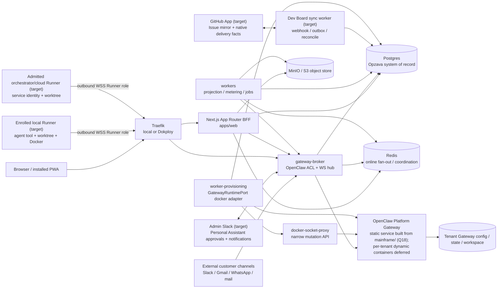

# Opzava Architecture

## What Opzava is

Opzava is an AI-workforce PM SaaS over OpenClaw: persona'd delegate agents act as human-like
teammates across Marketing, Support, and Finance, collaborating with humans in a Slack-grade
internal chat hub on an installable PWA. Opzava owns the multi-tenant product system of record,
policy, billing, approvals, audit, and user experience; OpenClaw owns runtime execution capabilities
such as sessions, channels, skills, memory/wiki, Workboard, cron, logs, diagnostics, and usage
behind the `gateway-broker` anti-corruption layer. CRM is deferred pending the future user-side
dashboard.

Current operating mode: Opzava runs single-tenant internally first to market and promote Opzava
itself. The scale-ready multi-tenant architecture is retained and runs one tenant now; Opzava is not
a public multi-tenant SaaS yet. The completed admin Tasks MVP is historical as-built substrate. The
current developer-operations target is the **Dev Board** defined by
[PRD-019](docs/prd/PRD-019-dev-board.md) and
[ADR-017](docs/adr/ADR-017-dev-board-authority-sync-execution.md). Its admin shell, navigation, and
Overview composition are governed by [PRD-020](docs/prd/PRD-020-admin-control-center.md) and the
[Admin Control Center foundation ledger](docs/plan/admin-control-center-foundation-decisions.md);
CRM remains deferred to the future user-side dashboard.

Q18 (2026-07-04, `docs/plan/grilling-decisions.md`): Opzava OWNS OpenClaw as a tracked fork at
`mainframe/` ([ADR-016](docs/adr/ADR-016-mainframe-tracked-fork.md)); the Platform Gateway is built
from that source, runs as a static Compose service, and dynamic per-tenant provisioning is
deferred-not-deleted (ADR-002 amendment). Production home is the Dokploy VPS; local compose remains
the dev/verify environment. PRD-020 now owns Admin Control Center placement; the frozen Control-UI
port program remains historical/parity evidence for the OpenClaw capabilities to harness. The
still-implemented `/tasks` and `/issues` routes are legacy migration inputs, not separate future
products. CRM is NEVER an Admin Control Center surface (user directive 2026-07-04): `/crm/*` routes
were removed on 2026-07-15 (GitHub issue #200), and the deferred CRM rebuild returns with the
user-side dashboard.

## Governing principles

| Principle                  | What it means here                                                                                                                                                                                                                                     |
| -------------------------- | ------------------------------------------------------------------------------------------------------------------------------------------------------------------------------------------------------------------------------------------------------ |
| Scale-ready modular DDD    | One pnpm/turborepo monorepo, one bounded-context package per domain, Drizzle/Postgres ownership per context, and no "MVP now, rewrite later" shortcut. See [ADR-001](docs/adr/ADR-001-stack-ddd-structure.md).                                         |
| OpenClaw capability parity | Harness OpenClaw's native runtime grain instead of cloning it: delegate agents, sessions, channels, Workboard, memory/wiki, skills, cron, TaskFlow, tool policy, approvals, logs, and usage.                                                           |
| Official docs before APIs  | Validate OpenClaw against `docs/openclaw` and every framework, language, and library against current official docs in [official-docs.md](docs/plan/official-docs.md) before coding. Training knowledge is a starting point, never the source of truth. |
| Agnostic ports             | Core domain code depends on capability ports, not vendors, provider SDKs, Gateway DTOs, payment-provider DTOs, or framework types.                                                                                                                     |
| Sad-path-first             | Design around tenant leaks, orphan Gateways, missed events, duplicate delivery, stale projections, prompt injection, dunning, bad provider callbacks, and remediation blast radius.                                                                    |
| Lean VPS ops               | Keep normal runtime cost O(tenants), not O(tenants x projects). Start with rootless Docker, self-hosted WS, Postgres outbox, Redis fan-out, MinIO/S3-compatible storage, and Dokploy parity.                                                           |

## System context

## Bounded-context map

| Context                                        | System of record                                                                                                                                                                                                                                                                                                                                                                                                                                                          | Owning ADR                                                                                                                                                          |
| ---------------------------------------------- | ------------------------------------------------------------------------------------------------------------------------------------------------------------------------------------------------------------------------------------------------------------------------------------------------------------------------------------------------------------------------------------------------------------------------------------------------------------------------- | ------------------------------------------------------------------------------------------------------------------------------------------------------------------- |
| Identity & Access                              | Opzava Postgres: users, organizations, memberships, invitations (planned — not in code), sessions, role grants (open question — see issue #94), external identities (planned — not in code), auth/RBAC mirrors.                                                                                                                                                                                                                                                               | [ADR-006](docs/adr/ADR-006-auth-better-auth.md), [ADR-007](docs/adr/ADR-007-rbac-rls.md)                                                                            |
| Tenant Provisioning                            | Opzava Postgres: tenant lifecycle, provisioning jobs, `GatewayInstance`, runtime leases, port/state reservations, compensating saga state.                                                                                                                                                                                                                                                                                                                                | [ADR-002](docs/adr/ADR-002-tenancy-provisioning.md), [ADR-019](docs/adr/ADR-019-provisioning-service-modularization.md)                                              |
| Platform-Ops                                   | Opzava Postgres: host placement, route health, repair/deprovisioning state, operational-health projections, remediation audit. Notifications/Admin-Observability owns Incident identity and lifecycle.                                                                                                                                                                                                                                                                    | [ADR-002](docs/adr/ADR-002-tenancy-provisioning.md), [ADR-013](docs/adr/ADR-013-error-admin-card.md), [ADR-015](docs/adr/ADR-015-deployment-parity.md)              |
| Runtime-Control                                | Opzava Postgres policy plus broker-mediated OpenClaw refs: runtime command admission, approvals, steering, aborts, command outcomes.                                                                                                                                                                                                                                                                                                                                      | [ADR-003](docs/adr/ADR-003-gateway-broker-acl-two-token.md), [ADR-004](docs/adr/ADR-004-data-boundary-cqrs.md), [ADR-005](docs/adr/ADR-005-tool-policy-security.md), [ADR-020](docs/adr/ADR-020-tenant-bounded-context-stores.md) |
| Dev Board (target)                             | Opzava Postgres: `DevTicket`, Ready Contract versions, workflow/gates, dependencies, Sprints, Proposals, assignments, execution leases/checkpoints, review evidence refs, Docs refs, GitHub synchronization/conflicts, Release desired lifecycle/manifests/approvals/attempts/rollback decisions, and audit. GitHub owns native repository facts; trusted build/registry owns artifact facts; Dokploy/runtime owns deployment facts; Incident owns operational lifecycle. | [ADR-017](docs/adr/ADR-017-dev-board-authority-sync-execution.md), [PRD-019](docs/prd/PRD-019-dev-board.md)                                                         |
| Project Management                             | Opzava Postgres: projects, boards, `pm.Card`, comments, assignments, approvals, SLA/customer impact, PM/admin read models.                                                                                                                                                                                                                                                                                                                                                | [ADR-004](docs/adr/ADR-004-data-boundary-cqrs.md)                                                                                                                   |
| Internal Collaboration                         | Opzava Postgres: internal channels, DMs, threads, messages, mentions, reactions, read cursors; Redis only for presence/typing TTL.                                                                                                                                                                                                                                                                                                                                        | [ADR-009](docs/adr/ADR-009-realtime-chat-pwa.md)                                                                                                                    |
| AI Workforce                                   | Opzava Postgres: `AgentEmployee`, personas, departments, autonomy tiers, standing orders, channel bindings, assignments, dispatch policy. OpenClaw owns delegate runtime artifacts.                                                                                                                                                                                                                                                                                       | [ADR-008](docs/adr/ADR-008-ai-workforce.md)                                                                                                                         |
| Knowledge Management                           | Opzava Postgres + object store: source documents, revisions, provenance, candidate KB entries, corpus refs, ingestion jobs, skill catalog policy. OpenClaw indexes are derived.                                                                                                                                                                                                                                                                                           | [ADR-010](docs/adr/ADR-010-knowledge-okf.md)                                                                                                                        |
| CRM                                            | **Deferred/removed 2026-07-15:** the previous schema was dropped by forward migration `0015_crm_removal`; its data model returns with the future user-side dashboard.                                                                                                                                                                                                                                                                                                     | [ADR-011](docs/adr/ADR-011-crm-channel-identity.md) (Deferred)                                                                                                      |
| External Channels                              | Opzava Postgres for future channel correlation/projections; OpenClaw Gateway for provider connectivity, credentials, external conversation runtime, sends/receives. The deferred CRM rebuild will consume `ChannelIdentity` resolution.                                                                                                                                                                                                                                   | [ADR-011](docs/adr/ADR-011-crm-channel-identity.md), [ADR-003](docs/adr/ADR-003-gateway-broker-acl-two-token.md)                                                    |
| Department Workflows                           | Opzava Postgres: `Workflow`/`Playbook`, mechanisms, approvals, workflow runs, run steps, campaigns, content pipeline, reports, run limits. OpenClaw executes provisioned mechanisms.                                                                                                                                                                                                                                                                                      | [ADR-012](docs/adr/ADR-012-dept-workflow-engine.md)                                                                                                                 |
| Finance & Billing                              | Opzava Postgres: plans, subscriptions, invoices, usage meters, meter events, entitlement state, quota policy, dunning. Billing is deferred; `BillingPort` is a null-adapter seam until external monetization.                                                                                                                                                                                                                                                             | [ADR-014](docs/adr/ADR-014-billing-metering.md)                                                                                                                     |
| Notifications/Admin-Observability              | Opzava Postgres: notifications, `ErrorGroup`/Incident identity and lifecycle, error events, alert routes, remediation actions, and platform/tenant Incident projections.                                                                                                                                                                                                                                                                                                  | [ADR-013](docs/adr/ADR-013-error-admin-card.md), [ADR-021](docs/adr/ADR-021-durable-redacted-doctor-scan.md)                                                        |
| Gateway Runtime                                | OpenClaw Gateway per tenant: sessions, runs, task ledger, streaming, Workboard, logs, diagnostics, health, usage/cost snapshots.                                                                                                                                                                                                                                                                                                                                          | [ADR-003](docs/adr/ADR-003-gateway-broker-acl-two-token.md), [ADR-004](docs/adr/ADR-004-data-boundary-cqrs.md)                                                      |
| Channel / Automation / Skills / Memory Runtime | OpenClaw Gateway per tenant: channel runtime and secrets, cron, TaskFlow, standing-order execution, skills, memory-wiki, memory-lancedb, Gateway-local config.                                                                                                                                                                                                                                                                                                            | [ADR-003](docs/adr/ADR-003-gateway-broker-acl-two-token.md), [ADR-010](docs/adr/ADR-010-knowledge-okf.md), [ADR-012](docs/adr/ADR-012-dept-workflow-engine.md)      |

### Admin Control Center composition boundary

The **Admin Control Center** is an admin-only shell and composition surface, not a bounded context
and not another system of record. [PRD-020](docs/prd/PRD-020-admin-control-center.md), its
[foundation ledger](docs/plan/admin-control-center-foundation-decisions.md), and the
[capability-parity map](docs/plan/capability-parity.md) define current placement. The selected
**Admin Overview** is Variant A, **Priority Command Center**, and is distinct from Dev Board
Summary. It composes read-only projections from Dev Board, Notifications/Admin-Observability,
Runtime-Control, Connections/Platform-Ops, and Identity & Access/Security; OpenClaw Overview facts
feed those source projections rather than creating a competing route.

Access is capability-backed, with Owner/Admin compatibility only for migration. The BFF resolves a
stable shell context, then produces a request-scoped sectioned snapshot under every source's own
ACL/RLS. Sections carry provenance and freshness, fail independently, and expose no raw secrets,
credentials, or Gateway/OpenClaw references. Global health/readiness is a platform-wide signal;
actionable attention is a separate actor-scoped queue. The shell never contains CRM, Marketing, or
Finance destinations, while operational Usage & Costs remains valid only as consumption, quota,
capacity, and spend projection, not billing, invoices, or Finance authority. This is an Admin
navigation boundary, not deletion of the deferred/system-wide business contexts. None of this target
composition is implemented merely by being documented or represented in the non-normative prototype
fixtures.

### Dev Board authority and external boundaries

WF-231-specific GitHub bootstrap/mirror detail in this target section belongs to the landed and
closed contract at `1db502d722ca33285148251a7660695868ad6a30`. Parent map #228 and the migration
manifest designate it current planning input until #237 consumes and freezes it. It remains target
architecture, not a claim that the adapter behavior is implemented.

The Dev Board is a dedicated bounded context, not a renamed `pm.Card` and not a composition of the
legacy Task and GitHub-Issue projections. A **DevTicket** is the aggregate; a **Card** is its visual
projection. An agent discovery begins as an Opzava-only Proposal. Once accepted into Backlog, the
DevTicket receives a durable GitHub Issue mirror. Incidents remain separate operational aggregates;
their permanent remediation is a linked Bug or Technical Task DevTicket.

Authority is deliberately split:

- **Opzava owns** the Ready Contract and its versions, lanes and transition gates, dependencies,
  Sprint goal/plan/order, Human Owner, Execution Assignee, Lead Orchestrator, Reviewer selection,
  Runner selection/admission, Execution Lease authorization/binding/fence state, governed execution
  branch/purpose binding, approval decisions, review verdict, and conflict resolution.
- **GitHub owns** its native issue number and URL and the observed provider PR, branch/ref/SHA,
  commit, check, repository-review, and merge facts. The GitHub Issue is a durable synchronized
  mirror and history surface, not a second workflow engine. Webhooks and an outbox synchronize
  managed content deterministically without an AI/model call; same-field governed conflicts become
  visible `SyncConflict` records.
- **The explicitly admitted Runner owns only its signed local execution observations**: execution
  presence, worktree, local branch, process, command, heartbeat, and checkpoint facts under the
  Opzava-owned lease/binding/fence state. Provider-native branch/ref/SHA facts are separate
  correlation inputs and never transfer authority. Only an enrolled local Runner owns access to the
  required local Docker Review stack. Each Runner makes an outbound WSS connection through a
  separately authenticated Runner role/path on the existing broker ingress; it never opens an
  inbound machine port or reuses a browser, MCP, OpenClaw Device/Node, or vendor-login identity.
  Durable typed delivery, a fenced lease, signed ordered receipts, an OS-supervised Lease Enforcer,
  persisted checkpoints, and reconnect reconciliation prevent stale or duplicate execution. V1 has
  no automatic cloud failover when the local machine disappears. See
  [WF-232](docs/plan/research/wf232-runner-control-protocol.md), landed at
  `4d88495700993e901b8c5bbb0e29bfcfbf6f5ccd`. Issue #232 is closed, and map #228 designates the
  protocol current planning input for #233, #235, and #237 until #237 consumes and freezes it. This
  is target-contract authority, not implemented product behavior.
- **Slack is a remote control/notification boundary**, not a secret store or alternate database. The
  Personal Assistant may deliver version-bound, expiring approval actions for the enrolled Admin;
  secret enrollment and security/integration changes return the user to an Opzava secure UI.
- **Review runs locally against the local Docker stack** with a separately configured fresh Reviewer
  and a locked commit/evidence package. Done means the mandatory review gate passed and the change
  merged into `development`; staging and production remain the separate Releases flow.
- **Releases is a separate aggregate and view after Done.** A trusted pipeline builds every
  candidate image once; the immutable Release Manifest pins source/tree, composition, provenance,
  OCI digests, signatures/SBOM, deployment/config hashes, migrations, checks, and evidence. Staging
  and production deploy the same digest bundle with fenced attempts, deterministic staging
  verification, distinct human Staging/Production Approvals, protected-main/tag confirmation,
  truthful provider observations, and rollback that never rewrites source history. Incident remains
  separately authoritative.

Do not collapse audit into one overloaded activity stream. The target keeps four cross-linked
ledgers with stable IDs and independent ordering/retention: (1) planning questions, recommendations,
decisions, rejected alternatives, and document/contract/Plan revisions; (2) accepted Dev Board
commands, comments, lane/assignment/dependency/approval changes, Review verdicts, and Done facts;
(3) Runner-signed local process, worktree/local-branch, command, receipt, heartbeat, checkpoint,
Docker, and reconnect observations correlated to Opzava-owned lease/fence/nonce refs—never the
lease, fence, nonce, containment, or release lifecycle records themselves; and (4) GitHub webhooks,
outbox attempts/confirmations, deduplication, health/replay/reconciliation, Sync Conflicts, and
their resolutions. Raw execution telemetry may expire under policy; relied-upon contracts,
approvals, review evidence, and durable history may not disappear with it.

The current `/tasks` and `/issues` routes, existing Task aggregate, manual issue projection, MCP
task tools, and environment-token adapter remain legacy as-built behavior until the migration
manifest replaces them. They must not be extended from Q17 or implementation issues #147–#157.

For the deep, module-level documentation behind this map, see
[docs/architecture/](docs/architecture/README.md). It documents every Module, Seam, and
port-to-Adapter count, grades each seam real or hypothetical, and lists prioritized deepening
opportunities; start at the [seam map](docs/architecture/SEAM-MAP.md).

## Agnostic ports catalog

| Port                                                    | Purpose                                                                                                                                                                                                                                                                                                                                                                                                                                                                             | Initial adapter                                                                                                                     |
| ------------------------------------------------------- | ----------------------------------------------------------------------------------------------------------------------------------------------------------------------------------------------------------------------------------------------------------------------------------------------------------------------------------------------------------------------------------------------------------------------------------------------------------------------------------- | ----------------------------------------------------------------------------------------------------------------------------------- |
| `OpenClawGatewayPort`                                   | Runtime RPC to OpenClaw capabilities through the ACL, including sessions, streams, tasks, channels, logs, diagnostics, usage, cron, approvals, skills, memory, and Workboard projections.                                                                                                                                                                                                                                                                                           | `gateway-broker` OpenClaw client                                                                                                    |
| `IssueTrackerPort` **(legacy — as built)**              | Current list/get/create/close-only issue seam used by `/issues` and the close outbox. It neither supplies the target Dev Board authority split nor consumes the credential enrolled by Connect GitHub. Retire/adapt it through the migration manifest; do not extend it as the Dev Board contract.                                                                                                                                                                                  | Environment-token GitHub REST adapter                                                                                               |
| `DevBoardMirrorPort` **(target facade — not in code)**  | Dev Board-facing application facade consumed by Dev Board application code and implemented by the deep Integration module for accepted mirror intents, normalized provider facts, health, and conflicts. The Integration module consumes the focused provider capabilities below; no GitHub DTO or raw credential crosses the facade.                                                                                                                                               | `DevBoard.GitHubIntegration` module                                                                                                 |
| `CodeHostInstallationPort` **(target — not in code)**   | Verify App identity, installation/repository access, granted capabilities, ephemeral token minting, lifecycle drift, and provider revocation observations.                                                                                                                                                                                                                                                                                                                          | Single-repository GitHub App adapter                                                                                                |
| `WorkItemMirrorPort` **(target — not in code)**         | Create/link/read and deterministically synchronize managed Issue body regions, labels, assignees, milestones, comments, worklogs, and provider-native state through normalized values and stable correlation.                                                                                                                                                                                                                                                                       | Single-repository GitHub App adapter                                                                                                |
| `DevelopmentFactsPort` **(target — not in code)**       | Read normalized Issue/PR/branch/commit/check/status/repository-review/merge facts by immutable provider identity and exact base/head/SHA correlation.                                                                                                                                                                                                                                                                                                                               | Single-repository GitHub App adapter                                                                                                |
| `CodeHostMergePort` **(target — not in code)**          | Dispatch only an exact #229-authorized merge and return provider confirmation; it owns no Review verdict or workflow decision.                                                                                                                                                                                                                                                                                                                                                      | Single-repository GitHub App adapter                                                                                                |
| `CodeHostReleasePort` **(target — not in code)**        | Dispatch only governed Release source/tag/publication commands and read normalized protected-main, tag, and GitHub Release facts; it owns no Release approval, artifact, deployment, or rollback decision.                                                                                                                                                                                                                                                                          | Single-repository GitHub App adapter                                                                                                |
| `AuthorizedGitRefUpdatePort` **(target — not in code)** | Accept an admitted #232 lease/nonce/exact-ref/old-SHA/new-SHA artifact reference plus digests from the ref-only WSS handoff. Immutable raw object-bundle bytes enter only through signed/scanned artifact ingress; the broker fetches and independently re-hashes them before a conditional push. Neither raw bundle bytes nor a write-capable installation token reaches Runner WSS.                                                                                               | Broker-confined GitHub App transport adapter                                                                                        |
| `ProviderClockAndRatePort` **(target — not in code)**   | Normalize provider date, conditional-read metadata, primary/secondary rate signals, retry-after/reset, and paced scheduling inputs for reconciliation and outbox workers.                                                                                                                                                                                                                                                                                                           | GitHub REST response/rate adapter                                                                                                   |
| `RunnerControlPort` **(target — not in code)**          | Durable delivery of already-authorized typed orders to an explicitly admitted local or orchestrator/cloud Runner and admission of authenticated liveness, signed/ordered receipts, checkpoints, containment, grant-disposition, and reconnect facts. It never accepts shell strings or owns claims, leases, lanes, approval, capacity, or recovery decisions.                                                                                                                       | Broker Runner-transport adapter plus Runner-side Codex Desktop, Codex CLI, Claude Code, and admitted cloud-service Harness Adapters |
| `HumanApprovalChannelPort` **(target — not in code)**   | Deliver notifications and accept actor/action/version/nonce/expiry-bound decisions while keeping enrollment, secrets, and security/integration trust changes in the secure Opzava UI.                                                                                                                                                                                                                                                                                               | Slack Personal Assistant adapter                                                                                                    |
| `ReviewEnvironmentPort` **(target — not in code)**      | Admit a configured independent Reviewer against an exact contract/SHA, run the local Docker verification environment, and return evidence/preview health without exposing raw secrets.                                                                                                                                                                                                                                                                                              | Enrolled Runner's local Docker/reviewer adapter                                                                                     |
| `BuildArtifactPort` **(target — not in code)**          | Queue and verify trusted build provenance, immutable OCI digests, signatures/attestations, SBOM, vulnerability policy, and registry availability for a candidate source subject.                                                                                                                                                                                                                                                                                                    | Trusted build system + OCI registry adapters                                                                                        |
| `DeploymentEnvironmentPort` **(target — not in code)**  | Request and reconcile fenced staging/production/rollback operations and source-versioned per-service effective digests, routing, and health.                                                                                                                                                                                                                                                                                                                                        | Dokploy Compose/deployment adapter plus target-runtime probes                                                                       |
| `EventBusPort` **(planned — not in code)**              | Domain events, outbox dispatch, projection notifications, and future broker swaps without changing domain code. Deleted from `packages/ports` in #160 because it had neither implementor nor consumer and the optional dependency silently discarded events. ADR-004 still holds; reintroduce the port only with the first approved Dev Board migration slice that ships both a durable outbox and a real consumer. Q17 S6/#152 is quarantined and is not implementation authority. | Postgres outbox + `LISTEN/NOTIFY` (to be built with its first consumer)                                                             |
| `GatewayRuntimePort`                                    | Connections/onboard-exec capability port: doctor scan, auth-choice/model probes, agent credential writes, and device/setup-token login lifecycle. Its Docker adapter resolves the static `openclaw-platform-gateway`; container lifecycle methods (provision, start, stop, suspend, resume, deprovision) are deferred with ADR-002/Q18 dynamic provisioning.                                                                                                             | Rootless Docker runtime                                                                                                             |
| `BillingPort`                                           | Subscription, plan, metered usage, invoice, dunning, and entitlement integration.                                                                                                                                                                                                                                                                                                                                                                                                   | Deferred null adapter; payment provider added only when external monetization starts                                                |
| `PushNotificationPort`                                  | Background notifications for mentions, approvals, assignments, assistant completions, and alerts.                                                                                                                                                                                                                                                                                                                                                                                   | Web Push with VAPID                                                                                                                 |
| `RealtimeTransportPort`                                 | Online fan-out for chat, activity, agent streaming, presence, typing, and notifications.                                                                                                                                                                                                                                                                                                                                                                                            | WebSocket hub + Redis backplane                                                                                                     |
| `AuthPort`                                              | Authentication, sessions, MFA/passkeys (planned — not in code), invitations (planned — not in code), password reset (planned — not in code), and session revocation.                                                                                                                                                                                                                                                                                                            | Better Auth                                                                                                                         |
| `AuthorizationPort`                                     | Fine-grained resource authorization, roles-as-data, tenant grants, and external guest checks; project grants are schema-ready but unused (open question — see issue #94).                                                                                                                                                                                                                                                                                                      | Opzava policy evaluator + Postgres                                                                                                  |
| `KnowledgeIndexPort`                                    | Search and retrieval against derived project/org/employee knowledge indexes.                                                                                                                                                                                                                                                                                                                                                                                                        | OpenClaw wiki + memory-lancedb over OKF                                                                                             |
| `KnowledgeSourcePort`                                   | Opzava-owned source of truth for KB documents, notes, and uploads that derived indexes are rebuilt from.                                                                                                                                                                                                                                                                                                                                                                            | Postgres + `ObjectStorePort`                                                                                                        |
| `SkillCatalogPort`                                      | Admin-curated catalog of installable OpenClaw skills, provisioned only via admin/provisioning.                                                                                                                                                                                                                                                                                                                                                                                      | Opzava catalog + provisioning worker                                                                                                |
| `SecretsVaultPort`                                      | Storage and retrieval of broker device tokens, provider references, and other secret handles without exposing raw secrets to domain code.                                                                                                                                                                                                                                                                                                                                           | Environment/vault-backed secret references                                                                                          |
| `ObjectStorePort`                                       | Durable source files, KB documents, report artifacts, uploads, and generated assets.                                                                                                                                                                                                                                                                                                                                                                                                | S3-compatible object store                                                                                                          |
| `ErrorCapturePort`                                      | Application, broker, worker, and ACL error capture with grouping hooks.                                                                                                                                                                                                                                                                                                                                                                                                             | Built-in incident ingestion, GlitchTip-compatible later                                                                             |
| `EmbeddingProviderPort`                                 | Embeddings for knowledge ingestion and search without coupling to a model provider.                                                                                                                                                                                                                                                                                                                                                                                                 | OpenClaw/provider adapter                                                                                                           |

## Cross-cutting invariants

| Invariant                                  | Consequence                                                                                                                                                                                                                                                                                                                                                                                                                                                                                                                                |
| ------------------------------------------ | ------------------------------------------------------------------------------------------------------------------------------------------------------------------------------------------------------------------------------------------------------------------------------------------------------------------------------------------------------------------------------------------------------------------------------------------------------------------------------------------------------------------------------------------ |
| Pure per-tenant Gateway                    | Every tenant has exactly one OpenClaw Gateway route and no production shared pool. `GatewayInstance.tenant_id` is unique. Q18: at the current N=1, that one Gateway is the static mainframe-built `openclaw-platform-gateway` service; dynamic provisioning resumes at multi-tenant.                                                                                                                                                                                                                                                       |
| Two-token model                            | Hot path uses a per-Gateway paired device token with `operator.write` + `operator.approvals`; admin/provisioning uses a separate paired `operator.admin` device credential (open question — see issue #90).                                                                                                                                                                                                                                                                                                                                 |
| Projections are cache                      | Postgres projections are rebuildable caches; OpenClaw RPC snapshots are truth for OpenClaw-owned runtime state; WS events are hints that trigger updates and reconciliation.                                                                                                                                                                                                                                                                                                                                                               |
| Command path is write-through              | User-visible commands apply the synchronous broker response immediately where read-your-writes matters; async projectors later replay idempotently.                                                                                                                                                                                                                                                                                                                                                                                        |
| Tool policy first                          | `SOUL.md`, personas, and standing orders describe behavior, but Gateway tool policy, Opzava approvals, RBAC, egress/channel allowlists, and audit enforce authority. SOUL can lie; tool policy cannot.                                                                                                                                                                                                                                                                                                                                     |
| RLS denial is hard 403                     | Missing or mismatched `app.current_org`, authorization denial, or tenant-context failure returns 403, never `200` with an empty list.                                                                                                                                                                                                                                                                                                                                                                                                      |
| No routable orphan Gateway                 | A Gateway may run and be Traefik-routable only with active entitlement, `tenant.lifecycle_state = Active`, valid `GatewayInstance`, live lease, expected labels/mounts/network, and current route.                                                                                                                                                                                                                                                                                                                                         |
| OpenClaw refs stay opaque                  | Session refs, task refs, run refs, Workboard refs, channel refs, approval refs, and Gateway refs are value objects, not Opzava foreign keys or identity.                                                                                                                                                                                                                                                                                                                                                                                   |
| Opzava owns business truth                 | Users, RBAC, PM cards, approvals, workflows, incidents, billing, audit, and source knowledge live in Opzava Postgres, not Gateway-local state. Deferred CRM customer truth returns with the user-side dashboard.                                                                                                                                                                                                                                                                                                                           |
| Dev Board gates are Opzava-owned           | GitHub writes can request transitions but cannot bypass Ready, dependency, lease, Review, approval, secret-exposure, or integration-health gates. GitHub remains authoritative for its native delivery facts, which Opzava observes before advancing.                                                                                                                                                                                                                                                                                      |
| Secrets do not duplicate                   | Channel/provider credentials stay in the tenant Gateway or secret store; Opzava stores secret references, reachability metadata, and broker/provisioning token refs only.                                                                                                                                                                                                                                                                                                                                                                  |
| Durable scheduled jobs                     | Durable scheduled jobs are owned by the Postgres-backed worker scheduler per [ADR-022](docs/adr/ADR-022-postgres-durable-worker-scheduler.md).                                                                                                                                                                                                                                                                                                                                                                                            |
| Runner transport is not workflow authority | A delivery acknowledgement, heartbeat, vendor event, MCP call, Slack message, or OpenClaw identity cannot grant a lease or change a lane. An ordinary typed Runner Receipt becomes an execution input only under current enrollment, connection, lease, fence, nonce, sequence, contract, and policy bindings. The only post-connection exception is a closed, independently Lease-Enforcer-signed authority-reducing containment fact under its last accepted arm/renew authority; it can never start, renew, resume, or widen authority. |

## Request and data flow

### Command path: write-through

1. Browser/PWA reaches `apps/web` through Traefik with a Better Auth-backed, DB-revocable session.
2. The BFF validates session, tenant lifecycle, RBAC through `AuthorizationPort`, quota/entitlement,
   CSRF/origin, and use-case policy.
3. Domain commands write Opzava state in a tenant-scoped transaction through
   `withTenant(orgId, fn)`, using Postgres RLS as a fail-closed backstop.
4. Runtime commands call `OpenClawGatewayPort`; the broker resolves tenant from Opzava context, not
   caller input, and routes to exactly one tenant Gateway.
5. The broker sends WS-first request/response commands with tenant-scoped idempotency keys, maps
   OpenClaw responses to Opzava DTOs/errors, and applies immediate read-model updates when the UI
   needs confirmed state.
6. Business approvals block product actions until Opzava `Approval = Approved`; OpenClaw
   `operator.approvals` gates only runtime exec/plugin prompts and is mirrored into the same
   chat/inbox surface.

### Event/projection path: durable outbox to online fan-out

1. Any transaction that changes domain state and needs downstream work writes an outbox row in the
   same Postgres transaction.
2. `LISTEN/NOTIFY` wakes workers, but workers also poll the outbox; missed notifications delay
   delivery but do not lose events.
3. Projection workers update read models with idempotent checkpoints and reconcile OpenClaw-owned
   state from broker RPC snapshots after gaps, reconnects, missed events, or unknown event families.
4. Online fan-out publishes accepted events through Redis to the broker WS hub; clients receive
   at-least-once delivery and deduplicate by event id, message id, idempotency key, or per-channel
   sequence.
5. Durable chat orders by per-channel Postgres `channelSeq`; presence and typing are Redis TTL hints
   only.
6. Web Push sends only safe hints; sensitive notification details are fetched after server session
   validation.

## Deployment topology

One canonical root `docker-compose.yml` is the deployment contract for local and Dokploy. AS BUILT
today the compose file has NO `profiles:` key: local Traefik starts unconditionally and serves the
web router plain-HTTP on `:18088`; mkcert wildcard TLS on `*.localhost` and the environment-profile
split are PLANNED (they land with the Dokploy bring-up slice, which must deliver Traefik+Let's
Encrypt on `*.opzava.app` live and the equivalent TLS path locally). Both environments share local
secret files vs Dokploy-managed secrets under the same keys, the shared external `dokploy-network`,
and the same service names, health checks, and labels.

Compose-managed services AS BUILT today (`docker compose config --services`) are `traefik`
(local-only today, currently unprofiled), `postgres`, `minio` + `minio-bucket-init` (one-shot),
`web`, `gateway-broker`, `provisioning-worker`, `docker-socket-proxy`, and
`openclaw-platform-gateway` — the static Platform Gateway, built from `./mainframe` per
[ADR-016](docs/adr/ADR-016-mainframe-tracked-fork.md) (Q18; previously the pulled upstream image).
Planned-but-not-yet-composed services from the original design (`pgbouncer`, `redis`,
`worker-projection`, `worker-metering`) arrive with the phases that need them — do not assume they
exist. Dynamic per-tenant Gateway containers (created by the provisioning worker through
`GatewayRuntimePort`, Traefik-labeled, reaper-reconciled) are deferred to the multi-tenant phase per
the ADR-002 amendment; the machinery is retained and already serves onboard-exec and operator
bootstrap.

Production home (Q18): the Dokploy VPS (6 vCPU / 12GB / 100GB NVMe). For governed Releases, the
trusted pipeline builds every service image once and publishes immutable manifest-pinned OCI
digests; Dokploy staging and production deploy those same digests without rebuilding. Local Compose
may build for development/Review, but those images are not Release artifacts. Public traffic
terminates at Traefik + Let's Encrypt on `*.opzava.app` (domain purchased at first live-dev push);
exactly ONE public WebSocket ingress exists (separately authenticated browser and enrolled-Runner
roles ↔ app/broker); the gateway has zero public listeners and its built-in Control UI is reachable
only by SSH tunnel (break-glass).

Docker host control is isolated: Traefik may read `/var/run/docker.sock` directly only for
Docker-provider discovery, `tecnativa/docker-socket-proxy` is the only mutation surface, only
`worker-provisioning` can reach the scoped mutation API, and the broker/web/projection/metering
services never receive Docker access. If Dokploy Traefik cannot discover plain Docker-provider
containers on `dokploy-network` with `exposedByDefault=false`, Opzava must run a dedicated Traefik
for tenant Gateway routing rather than relying on partial Swarm-provider behavior.

## ADR index

| ID                                                                | Title                                                                      | One-line decision                                                                                                                                                                                                                                                                                                                                                                                                                                                                                                                       | Status                                                                                  |
| ----------------------------------------------------------------- | -------------------------------------------------------------------------- | --------------------------------------------------------------------------------------------------------------------------------------------------------------------------------------------------------------------------------------------------------------------------------------------------------------------------------------------------------------------------------------------------------------------------------------------------------------------------------------------------------------------------------------- | --------------------------------------------------------------------------------------- |
| [ADR-001](docs/adr/ADR-001-stack-ddd-structure.md)                | Monorepo, DDD module structure, and locked stack                           | Use a pnpm/turborepo TypeScript monorepo with Next.js BFF, separate broker, workers, Drizzle/Postgres, bounded-context packages, and agnostic ports.                                                                                                                                                                                                                                                                                                                                                                                    | Accepted                                                                                |
| [ADR-002](docs/adr/ADR-002-tenancy-provisioning.md)               | Pure-per-tenant tenancy, GatewayRuntimePort, and provisioning saga         | Run exactly one OpenClaw Gateway per tenant from day one, managed by an idempotent provisioning saga behind `GatewayRuntimePort`.                                                                                                                                                                                                                                                                                                                                                                                                       | Accepted / dynamic provisioning deferred (Q18)                                          |
| [ADR-003](docs/adr/ADR-003-gateway-broker-acl-two-token.md)       | gateway-broker ACL, two-token model, and WS protocol client                | Put all OpenClaw runtime access behind a long-lived broker ACL with WS-first per-tenant clients and split hot-path/admin credentials.                                                                                                                                                                                                                                                                                                                                                                                                   | Accepted                                                                                |
| [ADR-004](docs/adr/ADR-004-data-boundary-cqrs.md)                 | Data model boundary, hybrid CQRS, outbox, and projections                  | Keep Opzava Postgres as product truth and OpenClaw as runtime truth, connected through hybrid CQRS, outbox, and broker snapshots/events.                                                                                                                                                                                                                                                                                                                                                                                                | Accepted                                                                                |
| [ADR-005](docs/adr/ADR-005-tool-policy-security.md)               | Tool-policy-first security, approval gates, and sandbox posture            | Make tool policy and Opzava approvals the hard authority boundary; avoid per-project sandboxes for standard agents.                                                                                                                                                                                                                                                                                                                                                                                                                     | Accepted                                                                                |
| [ADR-006](docs/adr/ADR-006-auth-better-auth.md)                   | Better Auth, revocable sessions, MFA/passkeys, and PWA auth                | Use Better Auth behind `AuthPort`, DB-revocable sessions, MFA/passkeys, and server-mediated PWA/Web Push auth.                                                                                                                                                                                                                                                                                                                                                                                                                          | Accepted                                                                                |
| [ADR-007](docs/adr/ADR-007-rbac-rls.md)                           | Resource-scoped RBAC, roles-as-data, and Postgres RLS                      | Use org/project-scoped RBAC behind `AuthorizationPort`, with tenant-scoped repositories and fail-closed Postgres RLS.                                                                                                                                                                                                                                                                                                                                                                                                                   | Accepted                                                                                |
| [ADR-008](docs/adr/ADR-008-ai-workforce.md)                       | AI Workforce, delegate agents, personas, and AgentDispatch                 | Model each AI employee as an OpenClaw delegate agent while Opzava owns workforce identity, policy, assignments, and `AgentDispatch`.                                                                                                                                                                                                                                                                                                                                                                                                    | Accepted                                                                                |
| [ADR-009](docs/adr/ADR-009-realtime-chat-pwa.md)                  | Realtime WS hub, internal chat, assistants-in-chat, and PWA/Web Push       | Run a broker-hosted WS hub with Redis fan-out and Postgres durability; treat AI assistants as first-class chat participants.                                                                                                                                                                                                                                                                                                                                                                                                            | Accepted                                                                                |
| [ADR-010](docs/adr/ADR-010-knowledge-okf.md)                      | Knowledge Management, OKF ingestion, and admin skill catalog               | Own KB sources in Postgres/object storage, rebuild OpenClaw memory/wiki/vector indexes from OKF, and install skills only through curated admin provisioning.                                                                                                                                                                                                                                                                                                                                                                            | Accepted                                                                                |
| [ADR-011](docs/adr/ADR-011-crm-channel-identity.md)               | CRM, external channel identity, and Contact resolution                     | Deferred: retained for the future user-side CRM rebuild; prior schema was dropped by `0015_crm_removal` on 2026-07-15 (GitHub issue #200).                                                                                                                                                                                                                                                                                                                                                                                              | Deferred                                                                                |
| [ADR-012](docs/adr/ADR-012-dept-workflow-engine.md)               | Department workflow engine, approvals, and content pipeline                | Let Opzava define workflows/playbooks and approvals while OpenClaw executes provisioned standing orders, cron, TaskFlow, sessions, and channels.                                                                                                                                                                                                                                                                                                                                                                                        | Accepted                                                                                |
| [ADR-013](docs/adr/ADR-013-error-admin-card.md)                   | Error-to-Incident pipeline and remediation loop                            | Own Incident/ErrorGroup identity and lifecycle, redaction, alerting, and constrained remediation in Opzava Postgres; project permanent fixes as linked Bug or Technical Task DevTickets.                                                                                                                                                                                                                                                                                                                                                | Accepted (amended by Dev Board pivot)                                                   |
| [ADR-014](docs/adr/ADR-014-billing-metering.md)                   | Billing, usage metering, and plan enforcement                              | Deferred: retain billing, metering, quotas, invoices, entitlement, and dunning design in Opzava; keep `BillingPort` as a null adapter until external monetization.                                                                                                                                                                                                                                                                                                                                                                      | Accepted / Deferred                                                                     |
| [ADR-015](docs/adr/ADR-015-deployment-parity.md)                  | Deployment and environment parity                                          | Use one canonical Compose deployment contract for local and Dokploy; trusted Release builds happen once and staging/production deploy the same manifest-pinned OCI digests.                                                                                                                                                                                                                                                                                                                                                             | Accepted / amended (Q18, Releases Gate, and landed WF-232 Runner trust)                 |
| [ADR-016](docs/adr/ADR-016-mainframe-tracked-fork.md)             | Own OpenClaw as a tracked fork (`mainframe/`)                              | Squash-import upstream at a pinned version, build the Platform Gateway from that source, and customize only via the rung 0–3 ladder so the upstream merge path survives.                                                                                                                                                                                                                                                                                                                                                                | Accepted (Q18)                                                                          |
| [ADR-017](docs/adr/ADR-017-dev-board-authority-sync-execution.md) | Dev Board authority, GitHub synchronization, local execution, and Releases | Make DevTicket and Release separate Opzava aggregates; use GitHub as durable mirror/native repository authority; fence execution, Review, build-once promotion, approvals, deployment attempts, and rollback.                                                                                                                                                                                                                                                                                                                           | Accepted (Dev Board pivot, capacity, Releases, and landed WF-232 Runner trust)          |
| [ADR-018](docs/adr/ADR-018-web-broker-principal-trust.md)         | web→broker principal trust                                                 | Resolves #194. Option 0 implemented: the web→broker acting-principal is narrowed to `tenantId` alone (the only field the broker verifies, against its pinned tenant); `sessionId`/`orgId`/`workspaceId`/`userId`/`roleKeys` are deleted from the boundary — an unverified claim that is never transmitted cannot be forged. Option 3 (per-tenant scoped internal token) deferred to the ADR-002 provisioning path before a broker fleet exists; Option 2 (signed assertions) deferred to the first real consumer; Option 1 (broker reads the session store) rejected on blast radius. ADR-003 conformed via a note: config-pinned single-tenant routing is the accepted realization of its derive-never-accept invariant under today's pure-per-tenant topology. | **Accepted** (2026-07-18) — Option 0 implemented in #194; Option 3 deferred to ADR-002 |
| [ADR-019](docs/adr/ADR-019-provisioning-service-modularization.md) | Provisioning service modularization                                       | Split connection provisioning into cohesive modules behind one thin facade, make fresh-snapshot config mutation capability-typed, share only the neutral Gateway wire, and expose interactive runtime operations through opaque handles.                                                                                                                                                                                                                                                                                              | **Accepted** (ratified 2026-08-12 by PRs #293/#295/#296/#294/#298/#302)                |
| [ADR-020](docs/adr/ADR-020-tenant-bounded-context-stores.md)      | Tenant bounded-context stores                                              | Put domain-typed store contracts in their bounded contexts, make Postgres adapters the only SQL owners, and enforce explicit tenant scope and hard-403 RLS through type, import, adapter, and test boundaries.                                                                                                                                                                                                                                                                                                                           | **Accepted** (ratified 2026-08-12 by PRs #297/#301)                                     |
| [ADR-021](docs/adr/ADR-021-durable-redacted-doctor-scan.md)      | Durable, redacted OpenClaw doctor scans                                    | Run bounded doctor lint scans through the runtime adapter, discard upstream free-form fields before append-only persistence, and coordinate execution with fenced leases while exposing only honest health states.                                                                                                                                                                                                                                                                                                                      | **Accepted** (ratified 2026-08-12 by PRs #299/#300; real-stack proof pending to close #280) |
| [ADR-022](docs/adr/ADR-022-postgres-durable-worker-scheduler.md)  | Postgres-backed durable worker scheduler                                   | Schedule typed idempotent or independently fenced handlers in tenant-protected Postgres using short `SKIP LOCKED` claims, out-of-transaction dispatch, and token-fenced acknowledgement.                                                                                                                                                                                                                                                                                                                                                 | **Proposed** (owner-approved 2026-08-13, implementation-contingent; flip to Accepted when the scheduler real-stack proof passes) |
