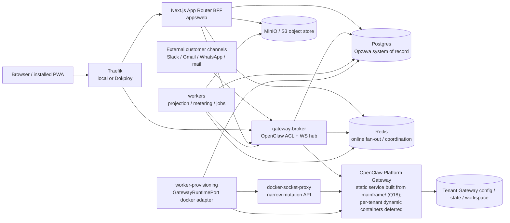

# Opzava Architecture

## What Opzava is

Opzava is an AI-workforce PM/CRM SaaS over OpenClaw: persona'd delegate agents act as human-like teammates across Marketing, Support, Finance, and CRM, collaborating with humans in a Slack-grade internal chat hub on an installable PWA. Opzava owns the multi-tenant product system of record, policy, billing, approvals, audit, and user experience; OpenClaw owns runtime execution capabilities such as sessions, channels, skills, memory/wiki, Workboard, cron, logs, diagnostics, and usage behind the `gateway-broker` anti-corruption layer.

Current operating mode (2026-07-02): Opzava runs single-tenant internally first to market and promote Opzava itself. The scale-ready multi-tenant architecture is retained and runs one tenant now; Opzava is not a public multi-tenant SaaS yet. The first business-value build after the admin-Tasks MVP is Marketing + CRM.

Q18 (2026-07-04, `docs/plan/grilling-decisions.md`): Opzava OWNS OpenClaw as a tracked fork at `mainframe/` ([ADR-016](docs/adr/ADR-016-mainframe-tracked-fork.md)); the Platform Gateway is built from that source, runs as a static Compose service, and dynamic per-tenant provisioning is deferred-not-deleted (ADR-002 amendment). Production home is the Dokploy VPS; local compose remains the dev/verify environment. The admin dashboard = Opzava-native admin surfaces (Tasks, Issues, Ask Admin) + the ported OpenClaw Control-UI views. CRM is NEVER an admin-dashboard surface (user directive 2026-07-04): its permanent home is the user-side dashboard; the current `/crm/*` routes in the admin app are a temporary Slice-3 parking spot pending relocation.

## Governing principles

| Principle | What it means here |
| --- | --- |
| Scale-ready modular DDD | One pnpm/turborepo monorepo, one bounded-context package per domain, Drizzle/Postgres ownership per context, and no "MVP now, rewrite later" shortcut. See [ADR-001](docs/adr/ADR-001-stack-ddd-structure.md). |
| OpenClaw capability parity | Harness OpenClaw's native runtime grain instead of cloning it: delegate agents, sessions, channels, Workboard, memory/wiki, skills, cron, TaskFlow, tool policy, approvals, logs, and usage. |
| Official docs before APIs | Validate OpenClaw against `docs/openclaw` and every framework, language, and library against current official docs in [official-docs.md](docs/plan/official-docs.md) before coding. Training knowledge is a starting point, never the source of truth. |
| Agnostic ports | Core domain code depends on capability ports, not vendors, provider SDKs, Gateway DTOs, payment-provider DTOs, or framework types. |
| Sad-path-first | Design around tenant leaks, orphan Gateways, missed events, duplicate delivery, stale projections, prompt injection, dunning, bad provider callbacks, and remediation blast radius. |
| Lean VPS ops | Keep normal runtime cost O(tenants), not O(tenants x projects). Start with rootless Docker, self-hosted WS, Postgres outbox, Redis fan-out, MinIO/S3-compatible storage, and Dokploy parity. |

## System context

## Bounded-context map

| Context | System of record | Owning ADR |
| --- | --- | --- |
| Identity & Access | Opzava Postgres: users, organizations, memberships, invitations, sessions, role grants, external identities, auth/RBAC mirrors. | [ADR-006](docs/adr/ADR-006-auth-better-auth.md), [ADR-007](docs/adr/ADR-007-rbac-rls.md) |
| Tenant Provisioning | Opzava Postgres: tenant lifecycle, provisioning jobs, `GatewayInstance`, runtime leases, port/state reservations, compensating saga state. | [ADR-002](docs/adr/ADR-002-tenancy-provisioning.md) |
| Platform-Ops | Opzava Postgres: host placement, route health, repair/deprovisioning state, ADMIN board projections, remediation audit. | [ADR-002](docs/adr/ADR-002-tenancy-provisioning.md), [ADR-013](docs/adr/ADR-013-error-admin-card.md), [ADR-015](docs/adr/ADR-015-deployment-parity.md) |
| Runtime-Control | Opzava Postgres policy plus broker-mediated OpenClaw refs: runtime command admission, approvals, steering, aborts, command outcomes. | [ADR-003](docs/adr/ADR-003-gateway-broker-acl-two-token.md), [ADR-004](docs/adr/ADR-004-data-boundary-cqrs.md), [ADR-005](docs/adr/ADR-005-tool-policy-security.md) |
| Project Management | Opzava Postgres: projects, boards, `pm.Card`, comments, assignments, approvals, SLA/customer impact, PM/admin read models. | [ADR-004](docs/adr/ADR-004-data-boundary-cqrs.md) |
| Internal Collaboration | Opzava Postgres: internal channels, DMs, threads, messages, mentions, reactions, read cursors; Redis only for presence/typing TTL. | [ADR-009](docs/adr/ADR-009-realtime-chat-pwa.md) |
| AI Workforce | Opzava Postgres: `AgentEmployee`, personas, departments, autonomy tiers, standing orders, channel bindings, assignments, dispatch policy. OpenClaw owns delegate runtime artifacts. | [ADR-008](docs/adr/ADR-008-ai-workforce.md) |
| Knowledge Management | Opzava Postgres + object store: source documents, revisions, provenance, candidate KB entries, corpus refs, ingestion jobs, skill catalog policy. OpenClaw indexes are derived. | [ADR-010](docs/adr/ADR-010-knowledge-okf.md) |
| CRM | Opzava Postgres: contacts, accounts, deals, pipelines, activities, tickets, segments, consent, `ChannelIdentity`, merge/erasure audit. | [ADR-011](docs/adr/ADR-011-crm-channel-identity.md) |
| External Channels | Opzava Postgres for channel correlation/projections; OpenClaw Gateway for provider connectivity, credentials, external conversation runtime, sends/receives. | [ADR-011](docs/adr/ADR-011-crm-channel-identity.md), [ADR-003](docs/adr/ADR-003-gateway-broker-acl-two-token.md) |
| Department Workflows | Opzava Postgres: `Workflow`/`Playbook`, mechanisms, approvals, workflow runs, run steps, campaigns, content pipeline, reports, run limits. OpenClaw executes provisioned mechanisms. | [ADR-012](docs/adr/ADR-012-dept-workflow-engine.md) |
| Finance & Billing | Opzava Postgres: plans, subscriptions, invoices, usage meters, meter events, entitlement state, quota policy, dunning. Billing is deferred; `BillingPort` is a null-adapter seam until external monetization. | [ADR-014](docs/adr/ADR-014-billing-metering.md) |
| Notifications/Admin-Observability | Opzava Postgres: notifications, error groups, error events, alert routes, remediation actions, tenant-visible incident projections. | [ADR-013](docs/adr/ADR-013-error-admin-card.md) |
| Gateway Runtime | OpenClaw Gateway per tenant: sessions, runs, task ledger, streaming, Workboard, logs, diagnostics, health, usage/cost snapshots. | [ADR-003](docs/adr/ADR-003-gateway-broker-acl-two-token.md), [ADR-004](docs/adr/ADR-004-data-boundary-cqrs.md) |
| Channel / Automation / Skills / Memory Runtime | OpenClaw Gateway per tenant: channel runtime and secrets, cron, TaskFlow, standing-order execution, skills, memory-wiki, memory-lancedb, Gateway-local config. | [ADR-003](docs/adr/ADR-003-gateway-broker-acl-two-token.md), [ADR-010](docs/adr/ADR-010-knowledge-okf.md), [ADR-012](docs/adr/ADR-012-dept-workflow-engine.md) |

For the deep, module-level documentation behind this map, see [docs/architecture/](docs/architecture/README.md).
It documents every Module, Seam, and port-to-Adapter count, grades each seam real or hypothetical, and lists prioritized deepening opportunities; start at the [seam map](docs/architecture/SEAM-MAP.md).

## Agnostic ports catalog

| Port | Purpose | Initial adapter |
| --- | --- | --- |
| `OpenClawGatewayPort` | Runtime RPC to OpenClaw capabilities through the ACL, including sessions, streams, tasks, channels, logs, diagnostics, usage, cron, approvals, skills, memory, and Workboard projections. | `gateway-broker` OpenClaw client |
| `EventBusPort` **(planned — not in code)** | Domain events, outbox dispatch, projection notifications, and future broker swaps without changing domain code. Deleted from `packages/ports` in #160: it had zero implementors and no consumer, and taking it as an optional dependency turned the missing adapter into a silent no-op — the code claimed to emit a domain event nothing could receive. ADR-004 still holds; Q17 S6 (#152) builds the outbox together with its first real consumer (the dispatcher), and re-introduces the port then. | Postgres outbox + `LISTEN/NOTIFY` (to be built with its first consumer) |
| `GatewayRuntimePort` | Provision, start, stop, health-check, suspend, resume, and deprovision per-tenant Gateway instances. | Rootless Docker runtime |
| `BillingPort` | Subscription, plan, metered usage, invoice, dunning, and entitlement integration. | Deferred null adapter; payment provider added only when external monetization starts |
| `PushNotificationPort` | Background notifications for mentions, approvals, assignments, assistant completions, and alerts. | Web Push with VAPID |
| `RealtimeTransportPort` | Online fan-out for chat, activity, agent streaming, presence, typing, and notifications. | WebSocket hub + Redis backplane |
| `AuthPort` | Authentication, sessions, MFA/passkeys, invitations, password reset, and session revocation. | Better Auth |
| `AuthorizationPort` | Fine-grained resource authorization, roles-as-data, tenant/project grants, and external guest checks. | Opzava policy evaluator + Postgres |
| `KnowledgeIndexPort` | Search and retrieval against derived project/org/employee knowledge indexes. | OpenClaw wiki + memory-lancedb over OKF |
| `KnowledgeSourcePort` | Opzava-owned source of truth for KB documents, notes, and uploads that derived indexes are rebuilt from. | Postgres + `ObjectStorePort` |
| `SkillCatalogPort` | Admin-curated catalog of installable OpenClaw skills, provisioned only via admin/provisioning. | Opzava catalog + provisioning worker |
| `SecretsVaultPort` | Storage and retrieval of broker device tokens, provider references, and other secret handles without exposing raw secrets to domain code. | Environment/vault-backed secret references |
| `ObjectStorePort` | Durable source files, KB documents, report artifacts, uploads, and generated assets. | S3-compatible object store |
| `ErrorCapturePort` | Application, broker, worker, and ACL error capture with grouping hooks. | Built-in incident ingestion, GlitchTip-compatible later |
| `EmbeddingProviderPort` | Embeddings for knowledge ingestion and search without coupling to a model provider. | OpenClaw/provider adapter |

## Cross-cutting invariants

| Invariant | Consequence |
| --- | --- |
| Pure per-tenant Gateway | Every tenant has exactly one OpenClaw Gateway route and no production shared pool. `GatewayInstance.tenant_id` is unique. Q18: at the current N=1, that one Gateway is the static mainframe-built `openclaw-platform-gateway` service; dynamic provisioning resumes at multi-tenant. |
| Two-token model | Hot path uses a per-Gateway paired device token with `operator.write` + `operator.approvals`; admin/provisioning uses short-lived, audited, job-scoped `operator.admin`. |
| Projections are cache | Postgres projections are rebuildable caches; OpenClaw RPC snapshots are truth for OpenClaw-owned runtime state; WS events are hints that trigger updates and reconciliation. |
| Command path is write-through | User-visible commands apply the synchronous broker response immediately where read-your-writes matters; async projectors later replay idempotently. |
| Tool policy first | `SOUL.md`, personas, and standing orders describe behavior, but Gateway tool policy, Opzava approvals, RBAC, egress/channel allowlists, and audit enforce authority. SOUL can lie; tool policy cannot. |
| RLS denial is hard 403 | Missing or mismatched `app.current_org`, authorization denial, or tenant-context failure returns 403, never `200` with an empty list. |
| No routable orphan Gateway | A Gateway may run and be Traefik-routable only with active entitlement, `tenant.lifecycle_state = Active`, valid `GatewayInstance`, live lease, expected labels/mounts/network, and current route. |
| OpenClaw refs stay opaque | Session refs, task refs, run refs, Workboard refs, channel refs, approval refs, and Gateway refs are value objects, not Opzava foreign keys or identity. |
| Opzava owns business truth | Users, RBAC, PM cards, CRM contacts, approvals, workflows, incidents, billing, audit, and source knowledge live in Opzava Postgres, not Gateway-local state. |
| Secrets do not duplicate | Channel/provider credentials stay in the tenant Gateway or secret store; Opzava stores secret references, reachability metadata, and broker/provisioning token refs only. |

## Request and data flow

### Command path: write-through

1. Browser/PWA reaches `apps/web` through Traefik with a Better Auth-backed, DB-revocable session.
2. The BFF validates session, tenant lifecycle, RBAC through `AuthorizationPort`, quota/entitlement, CSRF/origin, and use-case policy.
3. Domain commands write Opzava state in a tenant-scoped transaction through `withTenant(orgId, fn)`, using Postgres RLS as a fail-closed backstop.
4. Runtime commands call `OpenClawGatewayPort`; the broker resolves tenant from Opzava context, not caller input, and routes to exactly one tenant Gateway.
5. The broker sends WS-first request/response commands with tenant-scoped idempotency keys, maps OpenClaw responses to Opzava DTOs/errors, and applies immediate read-model updates when the UI needs confirmed state.
6. Business approvals block product actions until Opzava `Approval = Approved`; OpenClaw `operator.approvals` gates only runtime exec/plugin prompts and is mirrored into the same chat/inbox surface.

### Event/projection path: durable outbox to online fan-out

1. Any transaction that changes domain state and needs downstream work writes an outbox row in the same Postgres transaction.
2. `LISTEN/NOTIFY` wakes workers, but workers also poll the outbox; missed notifications delay delivery but do not lose events.
3. Projection workers update read models with idempotent checkpoints and reconcile OpenClaw-owned state from broker RPC snapshots after gaps, reconnects, missed events, or unknown event families.
4. Online fan-out publishes accepted events through Redis to the broker WS hub; clients receive at-least-once delivery and deduplicate by event id, message id, idempotency key, or per-channel sequence.
5. Durable chat orders by per-channel Postgres `channelSeq`; presence and typing are Redis TTL hints only.
6. Web Push sends only safe hints; sensitive notification details are fetched after server session validation.

## Deployment topology

One canonical root `docker-compose.yml` is the deployment contract for local and Dokploy. AS BUILT today the compose file has NO `profiles:` key: local Traefik starts unconditionally and serves the web router plain-HTTP on `:18088`; mkcert wildcard TLS on `*.localhost` and the environment-profile split are PLANNED (they land with the Dokploy bring-up slice, which must deliver Traefik+Let's Encrypt on `*.opzava.app` live and the equivalent TLS path locally). Both environments share local secret files vs Dokploy-managed secrets under the same keys, the shared external `dokploy-network`, and the same service names, health checks, and labels.

Compose-managed services AS BUILT today (`docker compose config --services`) are `traefik` (local profile), `postgres`, `minio` + `minio-bucket-init` (one-shot), `web`, `gateway-broker`, `provisioning-worker`, `docker-socket-proxy`, and `openclaw-platform-gateway` — the static Platform Gateway, built from `./mainframe` per [ADR-016](docs/adr/ADR-016-mainframe-tracked-fork.md) (Q18; previously the pulled upstream image). Planned-but-not-yet-composed services from the original design (`pgbouncer`, `redis`, `worker-projection`, `worker-metering`) arrive with the phases that need them — do not assume they exist. Dynamic per-tenant Gateway containers (created by the provisioning worker through `GatewayRuntimePort`, Traefik-labeled, reaper-reconciled) are deferred to the multi-tenant phase per the ADR-002 amendment; the machinery is retained and already serves onboard-exec and operator bootstrap.

Production home (Q18): the Dokploy VPS (6 vCPU / 12GB / 100GB NVMe). Dokploy builds all images from this repo with the same `build:` directives local uses. Public traffic terminates at Traefik + Let's Encrypt on `*.opzava.app` (domain purchased at first live-dev push); exactly ONE public WebSocket surface exists (browser ↔ app/broker); the gateway has zero public listeners and its built-in Control UI is reachable only by SSH tunnel (break-glass).

Docker host control is isolated: Traefik may read `/var/run/docker.sock` directly only for Docker-provider discovery, `tecnativa/docker-socket-proxy` is the only mutation surface, only `worker-provisioning` can reach the scoped mutation API, and the broker/web/projection/metering services never receive Docker access. If Dokploy Traefik cannot discover plain Docker-provider containers on `dokploy-network` with `exposedByDefault=false`, Opzava must run a dedicated Traefik for tenant Gateway routing rather than relying on partial Swarm-provider behavior.

## ADR index

| ID | Title | One-line decision | Status |
| --- | --- | --- | --- |
| [ADR-001](docs/adr/ADR-001-stack-ddd-structure.md) | Monorepo, DDD module structure, and locked stack | Use a pnpm/turborepo TypeScript monorepo with Next.js BFF, separate broker, workers, Drizzle/Postgres, bounded-context packages, and agnostic ports. | Accepted |
| [ADR-002](docs/adr/ADR-002-tenancy-provisioning.md) | Pure-per-tenant tenancy, GatewayRuntimePort, and provisioning saga | Run exactly one OpenClaw Gateway per tenant from day one, managed by an idempotent provisioning saga behind `GatewayRuntimePort`. | Accepted / dynamic provisioning deferred (Q18) |
| [ADR-003](docs/adr/ADR-003-gateway-broker-acl-two-token.md) | gateway-broker ACL, two-token model, and WS protocol client | Put all OpenClaw runtime access behind a long-lived broker ACL with WS-first per-tenant clients and split hot-path/admin credentials. | Accepted |
| [ADR-004](docs/adr/ADR-004-data-boundary-cqrs.md) | Data model boundary, hybrid CQRS, outbox, and projections | Keep Opzava Postgres as product truth and OpenClaw as runtime truth, connected through hybrid CQRS, outbox, and broker snapshots/events. | Accepted |
| [ADR-005](docs/adr/ADR-005-tool-policy-security.md) | Tool-policy-first security, approval gates, and sandbox posture | Make tool policy and Opzava approvals the hard authority boundary; avoid per-project sandboxes for standard agents. | Accepted |
| [ADR-006](docs/adr/ADR-006-auth-better-auth.md) | Better Auth, revocable sessions, MFA/passkeys, and PWA auth | Use Better Auth behind `AuthPort`, DB-revocable sessions, MFA/passkeys, and server-mediated PWA/Web Push auth. | Accepted |
| [ADR-007](docs/adr/ADR-007-rbac-rls.md) | Resource-scoped RBAC, roles-as-data, and Postgres RLS | Use org/project-scoped RBAC behind `AuthorizationPort`, with tenant-scoped repositories and fail-closed Postgres RLS. | Accepted |
| [ADR-008](docs/adr/ADR-008-ai-workforce.md) | AI Workforce, delegate agents, personas, and AgentDispatch | Model each AI employee as an OpenClaw delegate agent while Opzava owns workforce identity, policy, assignments, and `AgentDispatch`. | Accepted |
| [ADR-009](docs/adr/ADR-009-realtime-chat-pwa.md) | Realtime WS hub, internal chat, assistants-in-chat, and PWA/Web Push | Run a broker-hosted WS hub with Redis fan-out and Postgres durability; treat AI assistants as first-class chat participants. | Accepted |
| [ADR-010](docs/adr/ADR-010-knowledge-okf.md) | Knowledge Management, OKF ingestion, and admin skill catalog | Own KB sources in Postgres/object storage, rebuild OpenClaw memory/wiki/vector indexes from OKF, and install skills only through curated admin provisioning. | Accepted |
| [ADR-011](docs/adr/ADR-011-crm-channel-identity.md) | CRM, external channel identity, and Contact resolution | Own CRM truth in Postgres, resolve external senders conservatively through tenant-scoped `ChannelIdentity`, and project conversations into CRM. | Accepted |
| [ADR-012](docs/adr/ADR-012-dept-workflow-engine.md) | Department workflow engine, approvals, and content pipeline | Let Opzava define workflows/playbooks and approvals while OpenClaw executes provisioned standing orders, cron, TaskFlow, sessions, and channels. | Accepted |
| [ADR-013](docs/adr/ADR-013-error-admin-card.md) | Error-to-admin-card incident pipeline and remediation loop | Own incident grouping, redaction, ADMIN-card projection, alerting, and constrained remediation in Opzava Postgres. | Accepted |
| [ADR-014](docs/adr/ADR-014-billing-metering.md) | Billing, usage metering, and plan enforcement | Deferred: retain billing, metering, quotas, invoices, entitlement, and dunning design in Opzava; keep `BillingPort` as a null adapter until external monetization. | Accepted / Deferred |
| [ADR-015](docs/adr/ADR-015-deployment-parity.md) | Deployment and environment parity | Use one canonical Compose stack for local and Dokploy, with Traefik parity and runtime per-tenant Gateway containers created by provisioning. | Accepted / amended (Q18: static mainframe-built gateway, VPS home, one public WS surface) |
| [ADR-016](docs/adr/ADR-016-mainframe-tracked-fork.md) | Own OpenClaw as a tracked fork (`mainframe/`) | Squash-import upstream at a pinned version, build the Platform Gateway from that source, and customize only via the rung 0–3 ladder so the upstream merge path survives. | Accepted (Q18) |
