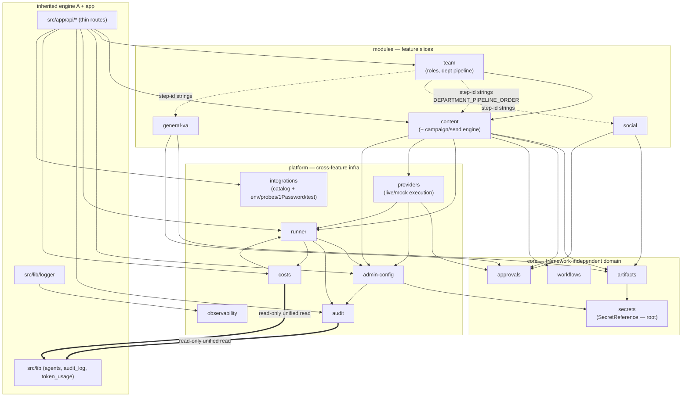
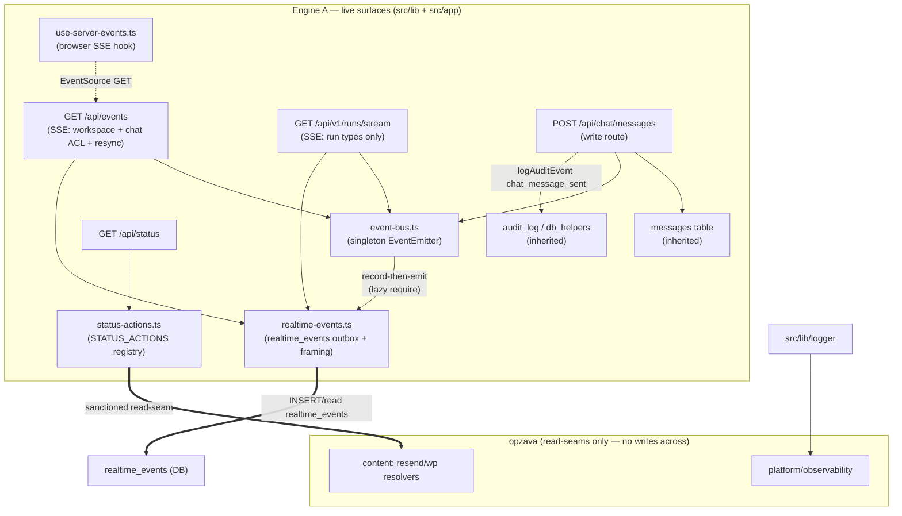

# Opzava Module Dependency Graph

> The living map of how `src/opzava` modules depend on each other and on the inherited engine. This
> complements `folder-structure.md` (the *rules*) and the colocated `MODULE.md` files (per-module
> *context*). When you change a cross-boundary import, update this graph in the same commit.
>
> **Edge legend**
> - `-->` solid = a static **import** dependency (the graph enforced by `src/opzava/architecture.test.ts`).
> - `-.->` dashed = a **string/value coupling** not captured by imports (team's step-id arrays).
> - `==>` dotted = a **read-seam** across the engine boundary (read-only; never writes across).

## Mermaid



## ASCII fallback (for agents that don't render Mermaid)

```
                         ┌──────────── ENGINE B: src/opzava ────────────┐
                         │                                               │
   core ──────────>  secrets (root)                      ┌── dashed: team step-id strings ──┐
       └── artifacts ──> secrets                         │   team ─ ─ ─> content / social /   │
       └── approvals                                    │                 general-va         │
       └── workflows                                    │   (not imports; enforced by        │
                         ▲                               │    test/stepid-coupling.test.mjs)  │
                         │ static imports (inward)       └────────────────────────────────────┘
   modules ──────────────┤
       content ──> core{artifacts,approvals,workflows}, platform{runner,providers,admin-config}
       content ──> team   (team ──> content via public barrel; the only cross-module import)
       social  ──> core{artifacts,approvals}
       general-va ──> core{artifacts,approvals}
   platform ────────────┐
       admin-config ──> core/secrets, audit          (admin-config re-exports SecretReference)
       runner ──> admin-config, audit, costs
       providers ──> admin-config, runner, core/approvals   (the one platform->core edge)
       costs ──> runner (cost-queries types)
       observability ──> (self-contained; consumed by src/lib/logger)
                         │
   app ──────────────────┘
       src/app/api/* ──> modules + platform (thin routes)
       src/lib/logger ──> observability

   ┄┄┄ dotted read-seams across the engine boundary (read-only) ┄┄┄
       audit  ═══> src/lib.audit_log       (unified audit count)
       costs  ═══> src/lib.token_usage     (unified cost summary)
                         │
                         ▼   boundary gate: the `agents` table (team <-> src/lib) — see ARD 0007,
                         │   enforced by test/engine-boundary.test.mjs
                         │
                         └──────────── ENGINE A: src/lib (inherited) ──────────┘
```

## Engine A — live surfaces (realtime spine + status registry)

Additive view of the **live `src/lib` surfaces** not modeled by the `src/opzava` graph above —
the realtime spine, the status-action registry, and the routes that drive them. These are Engine-A
internal edges (within `src/lib` + `src/app`) plus the sanctioned read-seams already shown. Full
per-surface context: `docs/architecture/engine-a-live-surfaces.md`. This subsection does not alter
the graph or legend above; it makes the live blind-edit zones navigable.



ASCII fallback (live surfaces only; the `src/opzava` graph above is unchanged):

```
   ENGINE A — live surfaces (src/lib + src/app) — additive to the graph above

   SSE routes ─────────> event-bus ──> realtime-events ──> realtime_events (DB outbox)
     /api/events            │            (record-then-emit;   ↑
     /api/v1/runs/stream    │             framing + replay)   │
                            │                                 │
                            └─> (lazy require, avoids db cycle)┘

   chat write route ─┬─> messages (INSERT)
     POST /api/chat/ ├─> audit_log   (logAuditEvent chat_message_sent — unified audit)
       messages      ├─> event-bus ──> realtime-events (outbox row, post-IO, NOT in a tx)
                     └─> db_helpers  (logActivity, createNotification)

   status registry ───> GET /api/status ──> STATUS_ACTIONS table (overview/dashboard/...)
     status-actions.ts  ────────────────==> content resolvers (read-seam; no write across)

   browser:  use-server-events.ts  ─ ─ EventSource ─ ─>  /api/events  ──> Zustand store
   logging:  src/lib/logger  ──>  opzava/platform/observability

   ── edges above the ENGINE A box are the read-seams already in the main graph ──
   ── NO edge crosses the team<->src/lib WRITE boundary (test/engine-boundary.test.mjs) ──
```

Notes specific to the live surfaces:
- **`event-bus → realtime-events` is a lazy `require()`** inside `broadcast`
  (`src/lib/event-bus.ts:69`) to avoid a `db.ts → event-bus.ts → db.ts` module cycle. Do not hoist
  it to a static import.
- **`chat POST → event-bus` runs AFTER gateway I/O** (up to ~21s) and the durable writes are NOT
  wrapped in a transaction — a CONFIRMED correctness gap, not a graph edge to "fix" by adding a
  new module (see `92-stale-findings.md` P1-1/P1-2).
- **`status-actions → content resolvers` is a sanctioned read-seam**, the same pattern as
  `audit`/`costs ⇒ src/lib` in the main graph: read-only config/secret resolution, never a
  provider execution (live probes stay at `POST /api/connections/test`).
- **`logger → observability`** is the one Engine-A→Engine-B edge already present in the main
  graph; repeated here for completeness.

## Notes

- **Acyclic.** All solid edges form a DAG; `src/opzava/architecture.test.ts` rejects cycles and the
  "platform must not import modules" / "core must not import platform" / "no cross-module internals"
  rules (the last two added in the realignment). The only `platform → core` edge is
  `providers → core/approvals` (the approval gate) — intentional and sanctioned.
- **`core/secrets` is the root** of the opzava graph (no dependencies). `core/artifacts` depends on it.
- **The team step-id coupling is invisible to import analysis** — that is exactly why
  `test/stepid-coupling.test.mjs` exists: to make a string-typed dependency machine-checkable.
- **Read-seams are read-only.** `audit`/`costs` read the inherited `audit_log`/`token_usage` tables
  for unified summaries but never write across the boundary (ARD 0007).
