# 06 — Visual Audit: Screenshot Evidence

These findings are grounded in real renders of the shipped Opzava UI captured in local mode with fresh data. Every screenshot in `screenshots/before/` was taken in the same browser session against a running development instance; no mocking, cropping, or compositing was applied. The screens therefore represent exactly what a first-time operator sees when they open the application and navigate through the sidebar.

---

## What the screenshots prove

- **Dual persistent alert banners appear on every single screen** (41 of 41 screenshots). Together they occupy 130–170 px of vertical real estate and expose 7 interactive controls (Update Now, Changelog, Copy Command, View Release, Run Doctor Fix, Show Details, plus two dismiss Xs) before the user reaches any page content. This violates Miller's Law: seven simultaneous choices at the top of every route exceeds the 7 ± 2 chunk limit before the user has even begun their task.

- **Four to six competing accent colors coexist in the same viewport on every screen.** Teal (primary CTAs), amber/yellow (warning CTAs), blue (info boxes), orange (step badges), green (status dots), and purple (avatar badges) all appear within the visible fold simultaneously. This destroys color-as-meaning and violates the Aesthetic-Usability Effect's single-accent-color principle — when everything is an accent, nothing is.

- **At least 25 of 41 screens are fully gated and render no usable content.** The entire visible page body consists of one lowercase sentence ("X is available in Full mode.") and two identically styled ghost buttons. This pattern — repeated across team, standup, office, skills, approval-queue, exec-approvals, campaigns, cron, content-runs, monitor, nodes, failures, artifacts, debug, cost-tracker, tokens, costs, memory, github, channels, super-admin, gateways, gateway-config, integrations, users, security, audit, alerts, webhooks, and maintenance — violates Doherty Threshold: the application provides zero task progress feedback within 400 ms, and the navigation implied by the sidebar is misleading about what is actually accessible.

- **All gated screens share the identical undifferentiated layout.** The only pixel difference between, say, `nodes.png` and `monitor.png` is the word "nodes" versus "monitor" inside a ~13 px lowercase sentence. Users cannot build a spatial mental model of the product or understand what they are unlocking. This violates Jakob's Law (users expect different destinations to look distinct) and the Gestalt Law of Similarity (identical appearance signals identical function).

- **Sub-15 px body text and low-contrast gray-on-near-black copy appear on every gated and login screen.** Gate sentences such as "audit is available in Full mode." render at an estimated 13–14 px in mid-gray (#888 estimate) against near-black (#0a0a0a estimate), likely failing WCAG 2.2 SC 1.4.3 (4.5:1 minimum contrast for normal text). The login screen subtitle "AI Operations Control" and section descriptions on the Settings screen share the same failure.

- **Empty states across Activity, Agents, Logs, and all Kanban columns are non-actionable dead ends.** The Activity screen says "Try adjusting your filters" when all filters are at their defaults (All / All Types / 50); the Agents empty state has no CTA inside the blank area; the Log Viewer shows "No logs to display" with no explanation of why; all four Kanban columns display identical "Drop tasks here" placeholders with no consolidated guidance. This violates Doherty Threshold: users who reach these states have no next action visible within 400 ms.

- **Primary and secondary CTAs are indistinguishable across every gated screen.** "Switch to Full" and "Go to Overview" are rendered as peer outline-only buttons of equal visual weight on every gated page. The highest-priority action (mode upgrade) and the escape hatch (go back) share the same border weight, color, text size, and padding. This violates Hick's Law (equal choices maximize decision time) and Fitts's Law (estimated button height 28–30 px is below the 44 px touch target recommended by WCAG 2.2 SC 2.5.8).

- **The sidebar navigation gives no signal about which items are gated.** All 7+ nav icons render at identical opacity, size, and brightness regardless of whether the destination is functional (Agents, Chat, Overview) or fully gated (Monitor, Nodes, Debug, Gateways, etc.). There are no lock badges, muted states, or tooltips. Users discover gating only after clicking, violating WCAG 1.4.1 (Use of Color), Gestalt Law of Similarity, and the affordance principle.

- **Raw internal file paths and CLI error strings are exposed in product UI.** The Agents screen renders absolute file paths (/home/anthony/devtony/anito-opzava/.next/standalone/AGENTS.md) as body text, and the amber banner reads "openclaw mock: unsupported args: doctor" verbatim. Neither is actionable to a non-developer operator and both damage perceived quality, violating Jakob's Law.

- **The onboarding wizard and live operational data coexist on the same scroll plane** (overview screen). A 3-step "Launch Sequence" card sits above an already-populated Activity feed and Fleet Status table. This forces the user to reason simultaneously about setup tasks and live operational state, doubling decision complexity in violation of Hick's Law and Tesler's Law.

---

## Per-screen findings

### Authentication & Onboarding

#### Login

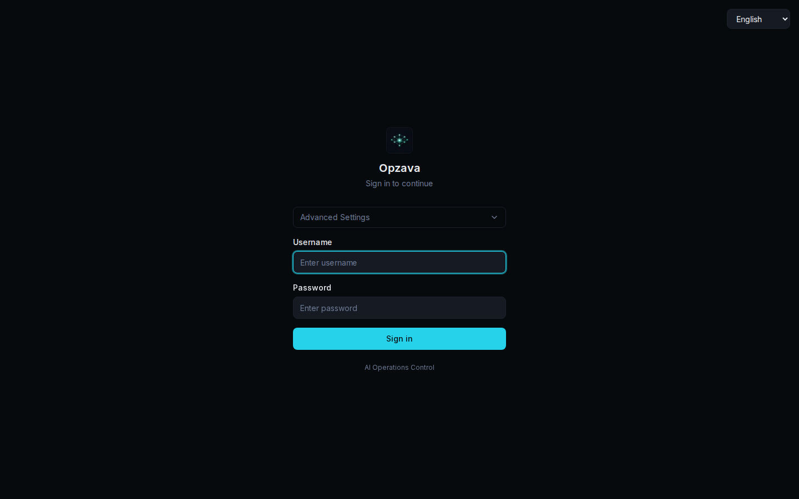

**What's rendered:** Centered login form on near-black background — logo, "Opzava" heading, subtitle, "Advanced Settings" accordion above credentials, bright cyan "Sign in" button.

| Severity | Problem | Law | Visible evidence | Fix |
|----------|---------|-----|-----------------|-----|
| P1 | "Advanced Settings" accordion appears above the username field, implying prerequisite configuration before sign-in | Jakob's Law / Gestalt Proximity | "Advanced Settings" dropdown sits between the product subtitle and the "Username" label, at the same visual hierarchy level as the input fields | Move "Advanced Settings" below the "Sign in" button as a small tertiary link; the primary credential flow must be uninterrupted |
| P2 | Subtitle text "AI Operations Control" is at or below 13 px in mid-gray (#888 estimate) against near-black, likely failing WCAG AA contrast | WCAG 1.4.3 (≥4.5:1) | Text is visibly smaller and lighter than all other elements, clearly below the 15 px floor | Remove the redundant tagline or raise to ≥16 px at ≥4.5:1 contrast (~#bbb or brighter on #0d0d0d) |
| P3 | Excessive equal whitespace above and below the form creates an unanchored, floating card with no ground plane | Gestalt Figure-Ground | ~200 px of empty black above the logo and ~350 px below the footer text; no card surface or border differentiates the form from the page | Add a subtle card surface (bg-zinc-900, 1 px border-zinc-800) or reduce vertical padding to seat the form in the upper-center third |

---

#### Onboarding Wizard

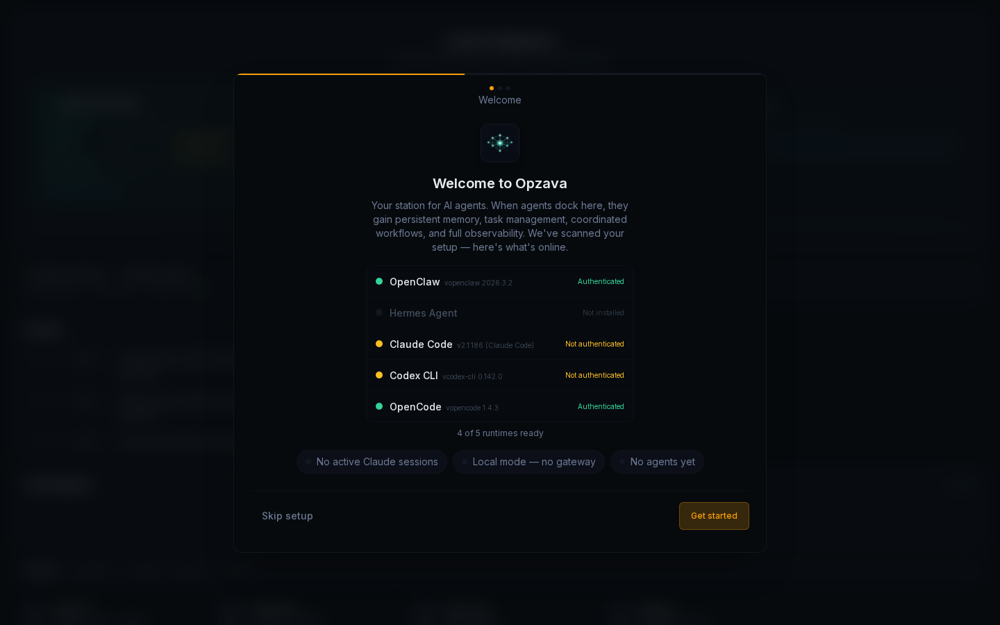

**What's rendered:** Modal-style step 1/3 ("Welcome") with a runtime status list, three status-badge pills, "Skip setup" and "Get started" buttons over a blurred app background.

| Severity | Problem | Law | Visible evidence | Fix |
|----------|---------|-----|-----------------|-----|
| P1 | Three status-badge pills use color-only differentiation with no icons or labels to distinguish informational from actionable states | WCAG 1.4.1 Use of Color / Gestalt Similarity | Three identical dark rounded pills in a horizontal row — "No active Claude sessions", "Local mode — no gateway", "No agents yet" — all same muted style with no icons, no color variance, no hover state | Assign semantic icons and colors: yellow warning icon for blocking states, gray info icon for informational-only; make actionable pills clickable with a clear hover state |
| P2 | Amber progress bar bleeds full viewport width and is visually disconnected from the modal card it represents | Gestalt Proximity / Common Region | Thin amber bar spans edge-to-edge at ~y:100 px; the modal card begins ~30 px below it with a visible gap, severing the progress–content association | Constrain the bar to the modal card width inside its top edge, or remove it in favour of the step-dot indicators already present |
| P2 | Runtime status ("Not authenticated", "Not installed") shown without an in-context next-step affordance | Doherty Threshold / Hick's Law | Claude Code and Codex CLI show yellow "Not authenticated" labels; Hermes Agent shows "Not installed" — the only action button is "Get started" with no per-row remediation link | Add an inline "Authenticate" or "Install" link per affected row so the user can resolve warnings before proceeding |

---

#### Onboarding Wizard (Mobile)

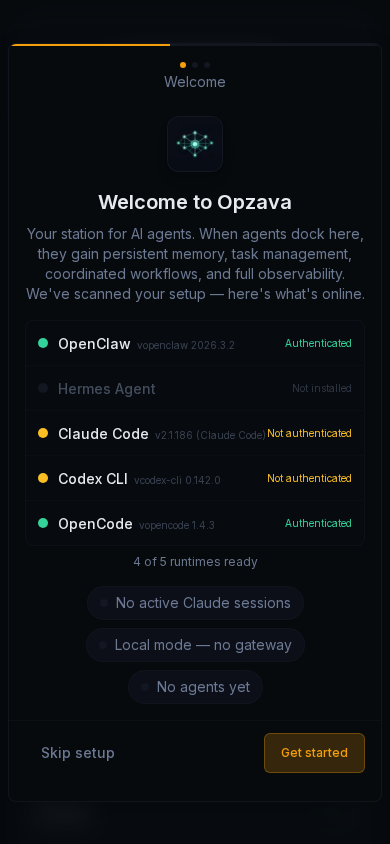

**What's rendered:** The same onboarding wizard in a narrow ~390 px viewport — runtime list, three status pills, and action buttons.

| Severity | Problem | Law | Visible evidence | Fix |
|----------|---------|-----|-----------------|-----|
| P1 | Three status pills stack vertically and remain visually indistinguishable, compounding the desktop problem at smaller scale | WCAG 1.4.1 / Miller's Law | Three stacked dark rounded rectangles ~40 px tall each, full width, identical dark styling, no icons or color variation | Replace with a single summary line ("Setup incomplete — 3 items need attention ›") saving vertical space for the runtime list |
| P1 | Text collision: version string and status label run together with no spacing in the Claude Code row | Gestalt Figure-Ground / WCAG 1.4.4 Resize Text | "v2.1186 (Claude Code)Not authenticated" reads as a run-on string with no gap between version badge and amber status label | Two-line row layout on mobile: runtime name + version on line 1, status on line 2 with its icon; enforce ≥8 px column gap |
| P2 | "Skip setup" plain-text link shares a row with the filled "Get started" button but has an insufficient tap target | Fitts's Law / WCAG 2.5.8 | "Skip setup" is small muted text bottom-left; "Get started" is a full amber button bottom-right; the tap target for "Skip setup" appears below 44 px | Make "Skip setup" a minimum 44×44 px ghost button with adequate padding, or relocate it above the CTA row as an explicit "I'll do this later" link |

---

### Core Operational Screens

#### Overview / Dashboard

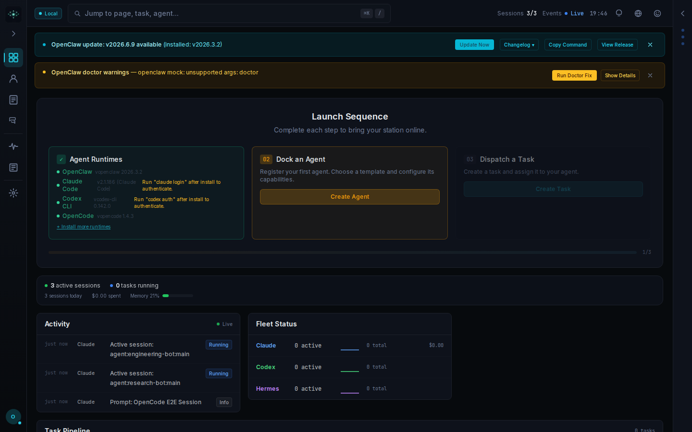

**What's rendered:** Main dashboard — two persistent system alert banners, a 3-step Launch Sequence wizard card, a status bar, and Activity + Fleet Status panels below.

| Severity | Problem | Law | Visible evidence | Fix |
|----------|---------|-----|-----------------|-----|
| P0 | Two simultaneous full-width alert banners consume ~20% of vertical real estate before any content, each with 3–4 action buttons (6 competing CTAs total) | Miller's Law / Gestalt Figure-Ground | Teal "OpenClaw update" banner + amber "OpenClaw doctor warnings" banner both fully expanded and stacked; 6 CTAs (Update Now, Changelog, Copy Command, View Release, Run Doctor Fix, Show Details) visible before primary content | Collapse to a single dismissible "System Alerts (2)" bar or notification tray icon; limit simultaneous expanded banners to one, prioritised by severity |
| P1 | Four competing accent colors in view simultaneously destroy color-as-meaning | Aesthetic-Usability Effect / Gestalt Uniform Connectedness | Teal "Update Now" button, amber "Run Doctor Fix" + "Show Details", orange step badge "02", green dot on "Active sessions", teal "Live" badge — all visible in the upper half | Reserve teal for interactive primary actions; map orange step badge and yellow warning button to the same amber token; use grayscale for all non-semantic backgrounds |
| P1 | Banner action buttons are tightly packed with ~4 px gaps and include four visually identical pills for very different consequences | Fitts's Law / WCAG 2.5.8 Target Size | "Update Now", "Changelog ▾", "Copy Command", "View Release" rendered at small pill size; "Changelog ▾" and "Copy Command" are same size and style despite different risk levels | Reduce banner to one primary CTA ("Update Now") + one ghost link ("Details"); move Changelog and Copy Command behind a "…" overflow menu |
| P1 | Onboarding wizard and live operational data coexist on the same scroll plane | Hick's Law / Tesler's Law | "Launch Sequence" 3-step card is in the center third while Activity rows labelled "Running" and a populated Fleet Status table are already visible below | Show wizard only when setup is genuinely incomplete; auto-dismiss or collapse to a sidebar nudge once at least one agent is running |

---

#### Activity

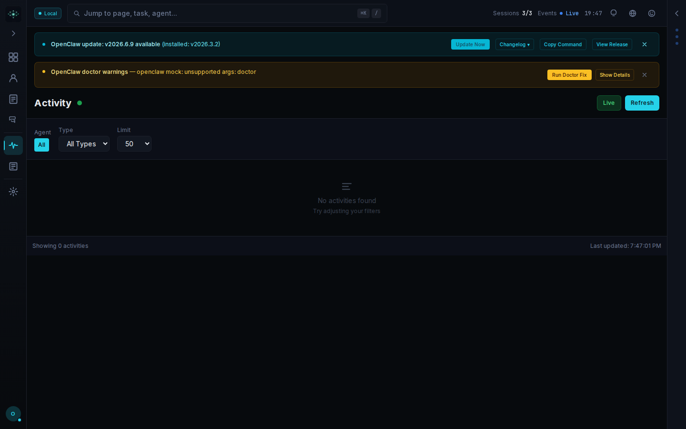

**What's rendered:** Activity page — two persistent banners, title row with "Live" toggle and "Refresh" button, filter controls (Agent: All, Type: All Types, Limit: 50), and a large empty state.

| Severity | Problem | Law | Visible evidence | Fix |
|----------|---------|-----|-----------------|-----|
| P0 | Empty state says "Try adjusting your filters" when all filters are at defaults (All / All Types / 50) | Jakob's Law / Doherty Threshold | Filter dropdowns show "All" and "All Types"; status bar reads "Showing 0 activities"; the empty state tells the user to adjust filters they haven't touched | When all filters are at defaults and 0 results are found, show "No activity yet — sessions will appear here once agents start running" with a CTA to Overview; reserve the filter-adjustment message for non-default filter states |
| P1 | "Live" (teal) and "Refresh" (solid teal filled) have nearly identical visual weight with no clear toggle-vs-action distinction | Hick's Law / Gestalt Similarity | "Live" is a teal-outlined badge-style control; "Refresh" is a solid teal filled button — placed side-by-side with approximately the same visual weight and color | Differentiate affordance types: "Live" as a toggle switch or icon-only blinking dot; "Refresh" as a secondary ghost button or icon-only; they must not share the same teal fill weight |
| P1 | Two persistent banners consume ~130 px on an empty screen, making the page feel broken | Miller's Law / Aesthetic-Usability Effect | Banner pair takes more vertical space than the entire data region on an already-empty screen; ~490 px of remaining space is blank black | Collapse banners to a notification icon badge in the top-right; this alone recovers 130 px of content real estate on every page |

---

#### Agent Chat

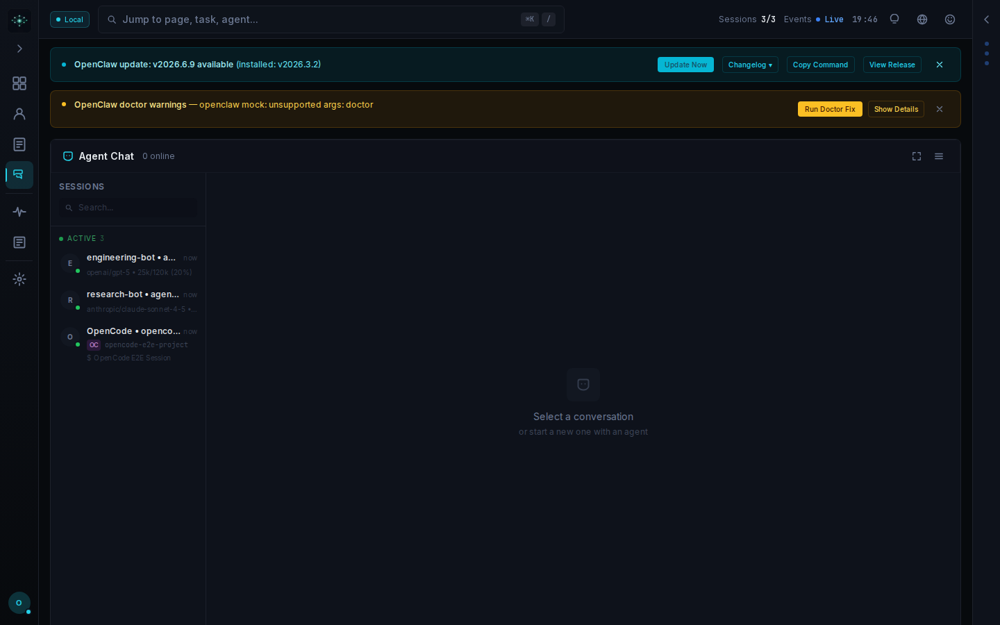

**What's rendered:** Agent Chat — two alert banners at top, narrow left session list with three active entries, large right pane in "Select a conversation" empty state.

| Severity | Problem | Law | Visible evidence | Fix |
|----------|---------|-----|-----------------|-----|
| P1 | Session list entries truncate all meaningful identity — model names and session names are cut mid-word | Gestalt Law of Closure / Jakob's Law | All three entries end with "…": "engineering-bot • a…", "research-bot • agen…", "OpenCode • openco…"; sub-labels also truncate | Widen the session sidebar to 260–280 px minimum, or use a two-line layout (bold session name / muted model on line 2) so the primary label is never clipped |
| P2 | Large empty right pane has no "New conversation" CTA despite three sessions already being listed | Doherty Threshold / Fitts's Law | ~1100 px pane shows a centered ghost icon and "or start a new one with an agent" in dim gray — but no visible button to actually start one | Add a prominently placed "New Conversation" accent-filled button inside the empty state or as a persistent "+" at the top of the sidebar |
| P2 | Purple avatar badge on the OpenCode session introduces an unexplained second accent color | Aesthetic-Usability / one-accent-color principle | "OC" badge in purple is visually distinct from all other teal accents on the page with no documented semantic meaning | Use neutral gray for all avatar initials; reserve teal exclusively for status/action accents; or define and document a deliberate semantic color system (e.g., purple = third-party agent) |

---

#### Tasks (Kanban Board)

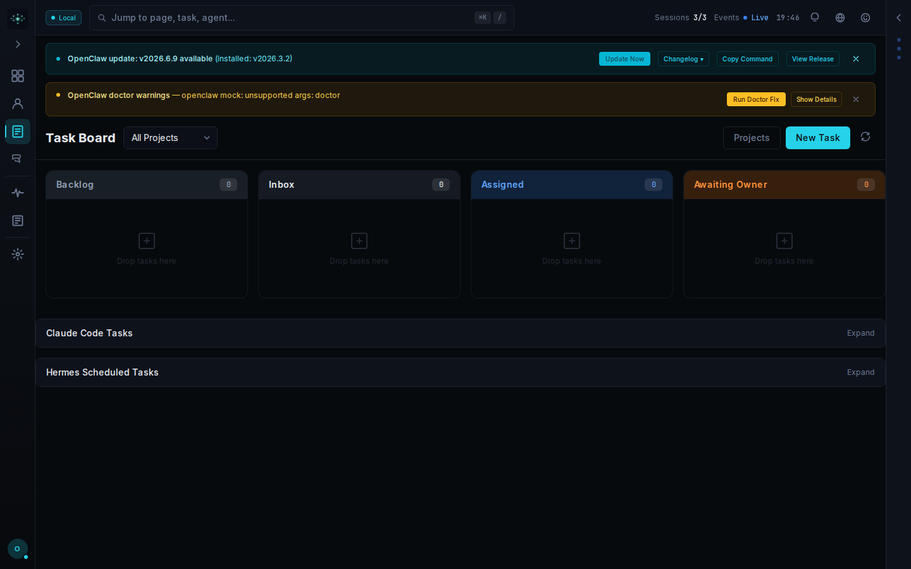

**What's rendered:** Kanban Task Board — two full-width banners, four columns (Backlog, Inbox, Assigned, Awaiting Owner) all at 0 items, two collapsed section rows below.

| Severity | Problem | Law | Visible evidence | Fix |
|----------|---------|-----|-----------------|-----|
| P1 | Two persistent banners consume ~25% of viewport before the board is visible | Miller's Law / Aesthetic-Usability Effect | Teal update banner + amber doctor-warnings banner stacked above the Task Board heading, each with 2–3 action buttons | Collapse both into a single notification dot/badge; never occupy full-width real estate for non-urgent system state |
| P1 | Four competing accent colors in one view violate the single-accent rule | Aesthetic-Usability Effect / Gestalt Figure-Ground | Teal "Update Now", amber "Run Doctor Fix", blue "Assigned" column header, orange "Awaiting Owner" column header — all visible simultaneously | Reserve teal for primary CTAs; use neutral dark backgrounds for Kanban column headers; encode status semantically only where required |
| P2 | Four identical "Drop tasks here" placeholders give no consolidated next-step guidance | Jakob's Law / Doherty Threshold | All four columns show identical dashed-border boxes with a "+" icon; all badge counts read "0" | Show a single consolidated empty-state with one CTA ("Create your first task"); hide or collapse empty columns |
| P2 | The teal banner alone exposes five interactive controls, creating choice overload before the user can begin any task | Hick's Law | "Update Now", "Changelog ▾", "Copy Command", "View Release", dismiss X — five targets in a single banner row | Surface only the single highest-priority action ("Update Now"); put Changelog/Copy Command behind a "…" overflow |

---

#### Agents

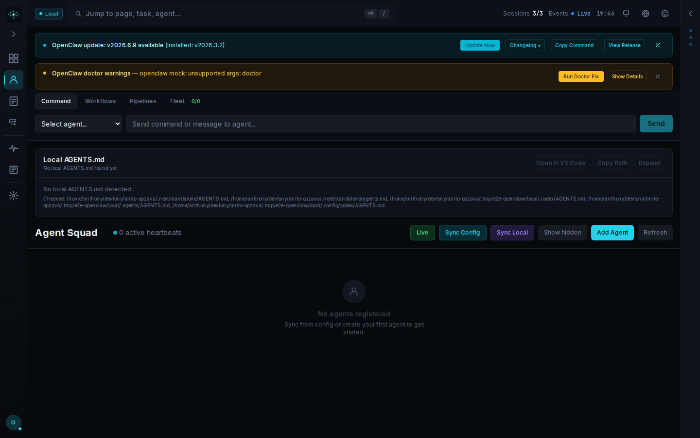

**What's rendered:** Agents page — two persistent banners, Command/Workflows/Pipelines/Fleet tab bar, empty AGENTS.md card with raw file paths, Agent Squad toolbar with five competing accent-colored buttons, large empty state below.

| Severity | Problem | Law | Visible evidence | Fix |
|----------|---------|-----|-----------------|-----|
| P1 | Five competing accent colors on one toolbar row | Aesthetic-Usability Effect / Gestalt Uniform Connectedness | Live=teal outline, Sync Config=dark-teal outline, Sync Local=purple outline, Show Hidden=gray outline, Add Agent=filled teal, Refresh=gray — six visual weights and three hues in one 40 px bar | Reserve teal for the single primary action (Add Agent); demote remaining buttons to a single neutral ghost style or icon-button overflow menu |
| P1 | Two persistent banners consume ~18% of viewport before page content | Miller's Law / Cognitive Load | Teal + amber banners each fully expanded and pinned, together occupying ~160 px of the top of every screen, forcing users to process 6 CTAs before reaching the page they navigated to | Collapse to a notification dot/badge; never auto-display more than one critical alert at a time |
| P2 | Raw absolute file paths rendered as body text in the main content area | Jakob's Law | Under "Local AGENTS.md — No local AGENTS.md found yet", three full absolute paths (/home/anthony/devtony/anito-opzava/.next/standalone/AGENTS.md etc.) are rendered as body paragraphs | Show "No AGENTS.md found" with a collapsed "Checked paths ▸" disclosure; raw paths must never appear at default zoom |
| P2 | Empty state below Agent Squad wastes ~350 px of vertical space with no CTA inside the empty zone | Doherty Threshold / Fitts's Law | Faint circle icon, "No agents registered" in medium gray, and sub-12 px guidance text with no button inside the empty area; only action is the "Add Agent" button in the toolbar above | Place a prominent "Add Agent" button (min 44 px tall, contrasting fill) directly inside the empty-state card co-located with the message |

---

#### Logs

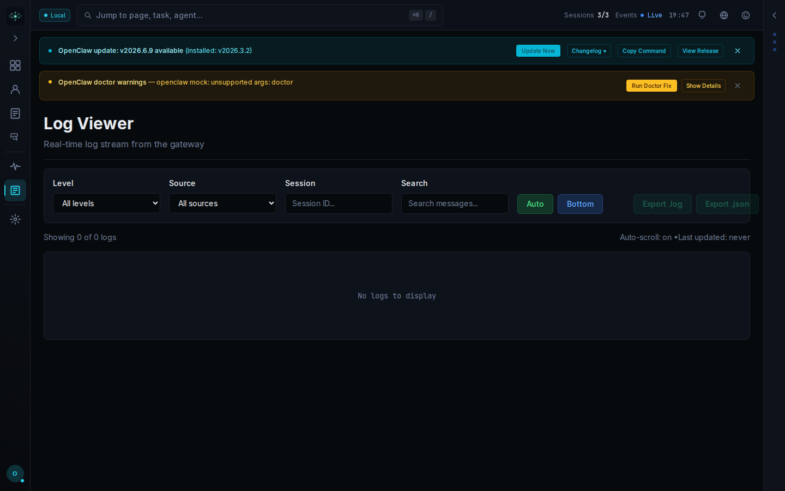

**What's rendered:** Log Viewer — two stacked banners, filter toolbar with four controls and two export buttons, nearly empty log area showing "No logs to display".

| Severity | Problem | Law | Visible evidence | Fix |
|----------|---------|-----|-----------------|-----|
| P1 | Two simultaneous alert banners present 7 action buttons before the user reaches the log viewer | Miller's Law / Hick's Law | Teal "OpenClaw update" banner + amber "OpenClaw doctor warnings" banner each with 2–3 CTAs, fully stacked | Collapse alerts into a single dismissible notification dot; never display two full-width banners simultaneously on a tool-focused screen |
| P1 | Teal, amber, and green coexist with no clear priority signal | Aesthetic-Usability Effect / Gestalt Figure-Ground | Top banner: teal left-border + teal "Update Now"; second banner: amber left-border + amber "Run Doctor Fix"; filter row: bright green "Auto" toggle — three distinct hues all at the same visual weight | Reserve teal for primary actions; encode severity through icon + text, not background color; use neutral gray outlines for secondary actions |
| P2 | Empty state "No logs to display" is an uninformative dead end | Doherty Threshold / Jakob's Law | Log pane shows "Showing 0 of 0 logs" and "Last updated: never" with no explanation of why or what to do | Add contextual guidance (gateway connection status, "Start a session to see live logs" or "Gateway not connected — check settings") with a direct fix link |
| P2 | Export buttons appear actionable when there is nothing to export | Tesler's Law / WCAG 1.4.1 | "Export .log" and "Export .json" render as active outline buttons despite "Showing 0 of 0 logs" | Disable and visually dim export buttons (reduced opacity, no pointer cursor) when log count is zero; add a tooltip explaining unavailability |

---

#### Settings

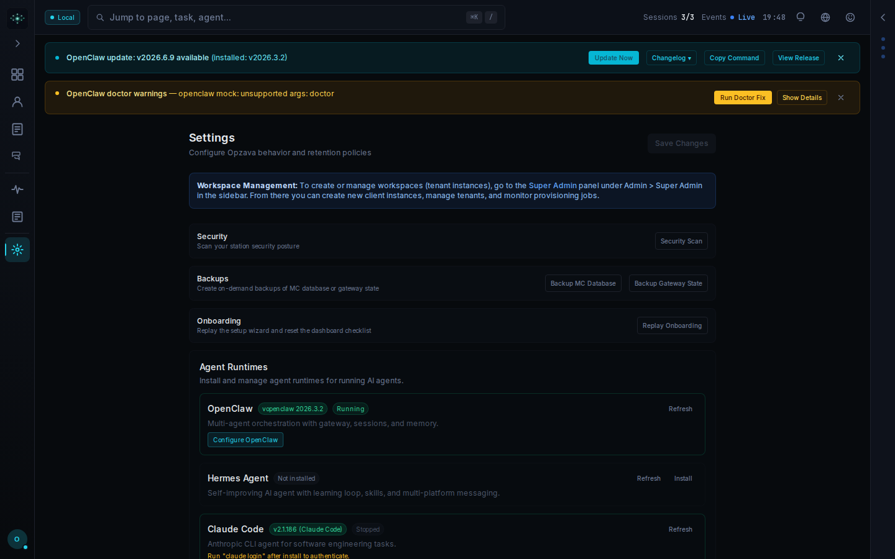

**What's rendered:** Settings page — two persistent banners, workspace management info box, three action rows (Security, Backups, Onboarding), Agent Runtimes section with OpenClaw/Hermes/Claude Code cards.

| Severity | Problem | Law | Visible evidence | Fix |
|----------|---------|-----|-----------------|-----|
| P0 | Two simultaneous full-width banners with 6 combined CTAs consume ~25% of vertical space | Miller's Law / Gestalt Figure-Ground | Teal banner (Update Now, Changelog, Copy Command, View Release) + amber banner (Run Doctor Fix, Show Details) both span full width below the header | Collapse all system notifications into a single dismissible notification tray; cap inline CTAs at one primary action per banner |
| P1 | Four CTAs on the update banner create decision paralysis | Hick's Law | "Update Now" (filled teal), "Changelog" (outlined), "Copy Command" (outlined), "View Release" (outlined) — four equal-weight buttons side by side | Promote only "Update Now" as filled; collapse Changelog/Copy Command/View Release into a "More ▾" dropdown |
| P1 | Workspace Management info box uses a blue accent competing with the teal system accent | Aesthetic-Usability Effect / WCAG 1.4.1 | Solid mid-blue rectangular info box directly beneath the teal + amber banner stack — three competing hue families above the fold | Replace the filled blue box with a subtle teal border-left rule on a dark-surface card |
| P2 | Sub-description text on section rows (Security, Backups, Onboarding) is visually small and low-contrast | WCAG 1.4.3 | Secondary description strings ("Scan your station security posture" etc.) appear at ~12–13 px in mid-gray, noticeably lighter than the bold section headings | Raise all body/description text to ≥15 px at ≥4.5:1 contrast against the background surface |

---

### Feature-Gated Empty States

> The following 28 screens all share the identical structural pattern: two stacked persistent banners + a centered lowercase gate sentence ("X is available in Full mode.") + two equal-weight ghost buttons ("Switch to Full" / "Go to Overview") + empty black void. Cross-cutting issues are called out once in the table; screen-specific problems are noted individually.

---

#### Notifications

**What's rendered:** Notifications page — two stacked banners, centered "notifications is available in Full mode." gate, two ghost buttons.

| Severity | Problem | Law | Visible evidence | Fix |
|----------|---------|-----|-----------------|-----|
| P0 | Page is a feature gate with no content, yet accessible from main navigation with no prior warning | Jakob's Law / Doherty Threshold | Page body contains only one sentence and two buttons; the bell icon in the nav gives no indication this page is gated before clicking | Either route the two alert banners as notification items, grey-out the nav icon with a tooltip, or remove the nav item in non-Full mode |
| P1 | Two persistent banners are the de facto main content of an otherwise-empty page | Gestalt Figure-Ground / Miller's Law | Both banners fully expanded at the top occupying ~130 px; the gate message occupies ~60 px; the banners visually outweigh the page's actual purpose | Collapse banners to a notification-count badge in the top-right; the page's gate message should be the dominant element |
| P2 | Gate message has a grammatical error and lowercase subject ("notifications is available") | Aesthetic-Usability Effect | Centered text reads "notifications is available in Full mode." — lowercase noun as sentence subject, inconsistent with "Welcome to Opzava" and other copy | Rewrite as "The Notifications feed is only available in Full mode." with sentence case throughout |

---

#### Team

**What's rendered:** Team page — two banners, centered "team is available in Full mode." gate, two equal-weight ghost buttons.

| Severity | Problem | Law | Visible evidence | Fix |
|----------|---------|-----|-----------------|-----|
| P0 | Feature-gated near-empty black screen with no explanation of what "Full mode" is or what is being missed | Jakob's Law / Doherty Threshold | Entire content area shows only the gate sentence and two buttons on an otherwise empty dark screen | Replace with a proper gate state: "Team (Full Mode)" heading, a one-sentence value prop, a primary filled "Enable Full Mode" CTA, and a secondary ghost link "Go to Overview" |
| P1 | "Switch to Full" and "Go to Overview" have equal visual weight — no primary action is signalled | Hick's Law / Fitts's Law | Both rendered as identical small outlined buttons side by side; neither is filled or accented | Fill "Switch to Full" with the accent color at ≥44 px height; render "Go to Overview" as a plain text link |
| P1 | Two banners (6 combined CTAs) dominate a page whose content is two buttons and one sentence | Cognitive Load / Miller's Law | Teal + amber banners with 6 CTAs visible above "team is available in Full mode." | Collapse banners globally to a notification icon; on gated pages this noise-to-signal ratio is extreme |

---

#### Standup

**What's rendered:** Identical layout to team — "standup is available in Full mode." gate.

| Severity | Problem | Law | Visible evidence | Fix |
|----------|---------|-----|-----------------|-----|
| P0 | Identical gate UI template as team with no feature-specific context whatsoever | Jakob's Law | Same sentence structure, same buttons, same empty black canvas; "standup" is the only distinguishing word | Add feature name as heading, one-sentence description ("Daily standup logs and summaries for each agent"), and a filled primary CTA |
| P1 | Gate message text fails WCAG AA contrast against the dark background | WCAG 2.2 SC 1.4.3 | "standup is available in Full mode." appears in medium-gray that visually blends into the near-black background; estimated contrast well below 4.5:1 | Render primary gate message in white or near-white (≥#e5e7eb) to meet 4.5:1 |
| P1 | Persistent dual alert banners dominate a blank content page | Cognitive Load | Same teal + amber banners with 6 CTAs above a page with one sentence of real content | Collapse banners globally to a notification badge |

---

#### Office

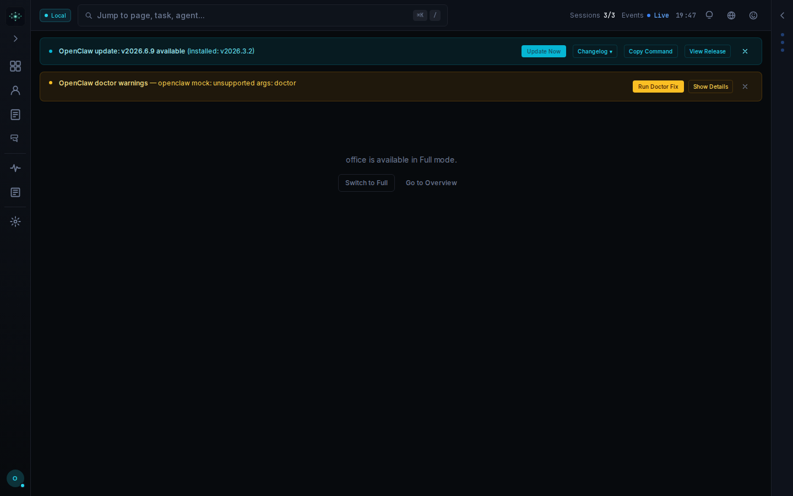

**What's rendered:** Identical layout — "office is available in Full mode." gate.

| Severity | Problem | Law | Visible evidence | Fix |
|----------|---------|-----|-----------------|-----|
| P0 | Third consecutive screen with the identical gate template and no feature context | Jakob's Law / Gestalt | Three separate nav destinations (team, standup, office) all render identical gate pages; the nav items feel non-functional | Create a reusable `<FeatureGate>` component that accepts a feature name, icon, description, and benefit bullets; each gated screen must be visually and contextually distinguishable |
| P1 | Nav items for gated features are indistinguishable from active ones in the sidebar | Gestalt Similarity / WCAG 1.4.1 | Left sidebar shows 8 icons at identical weight; no icon has a lock symbol, muted opacity, or tooltip indicating which require Full mode | Add a visible lock badge or 50% opacity treatment to sidebar nav icons for Full-mode-gated screens, with "Requires Full mode" tooltip on hover |

---

#### Skills

**What's rendered:** Identical layout — "skills is available in Full mode." gate.

| Severity | Problem | Law | Visible evidence | Fix |
|----------|---------|-----|-----------------|-----|
| P0 | Fourth gated screen with the identical undifferentiated gate template — the pattern repeats across 4 of 6 nav destinations | Jakob's Law | Pixel layout identical to team, standup, and office; "skills" is the only differing word | Immediately differentiate with unique heading ("Skills Library"), feature icon, and one-sentence description; long-term consolidate all four into a single "Upgrade to Full Mode" hub page |
| P1 | No persistent visual affordance in the nav distinguishes gated from active features | Hick's Law / WCAG 1.4.1 | 8 sidebar icons at identical opacity; skills, team, standup, and office are indistinguishable from agents and chat | Apply a lock-badge overlay or 40% opacity dimming to gated nav items + "Full mode required" tooltip |
| P1 | Both alert banners persist on a page with functionally no content | Cognitive Load / Tesler's Law | Teal + amber banners (6 combined CTAs) contain more interactive surface than the page itself | Move banners to a persistent notification icon in the header with a count badge; never auto-expand on gated pages |

---

#### Approval Queue

**What's rendered:** Near-blank screen — two banners, centered "approval queue is available in Full mode." gate.

| Severity | Problem | Law | Visible evidence | Fix |
|----------|---------|-----|-----------------|-----|
| P0 | Page is entirely non-functional — the entire content area is replaced by a mode-gate message | Doherty Threshold / Jakob's Law | Full page body below the two banners is empty black space; the only content is the small centered gate sentence and two buttons | Either unlock the feature or replace with a proper upgrade state: show what the queue looks like, with a clear prominent upgrade path |
| P1 | Gate message text has extremely low contrast against the black background | WCAG 2.2 SC 1.4.3 | "approval queue is available in Full mode." appears as mid-gray text on solid black, visually very dim compared to white banner text above | Use white or near-white (≥#E0E0E0) for all body content on dark backgrounds; verify ratio ≥4.5:1 |
| P1 | Two persistent banners obscure 25% of an already-empty screen | Aesthetic-Usability / Miller's Law | Identical teal + amber banners from all other screens at identical positions; page has no real content | Move notifications to a collapsible notification drawer, not inline banners on every route |

---

#### Exec Approvals

**What's rendered:** Identical layout — "exec approvals is available in Full mode." gate.

| Severity | Problem | Law | Visible evidence | Fix |
|----------|---------|-----|-----------------|-----|
| P0 | Feature entirely gated — screen renders no content | Doherty Threshold / Jakob's Law | Full viewport below banners is black; only text is the gate sentence centered in the middle | Show a meaningful preview or placeholder with one clear upgrade CTA; never leave a routed page as near-blank |
| P1 | Duplicate mode-gate pattern across approval-queue, exec-approvals, campaigns, cron, and content-runs — the majority of nav items lead nowhere | Jakob's Law / Gestalt Consistency | Button labels "Switch to Full" and "Go to Overview" and the black background are identical across all five screens | Audit the nav — if 5 of 6 screens are gated, either hide them or redesign the gate as a rich feature-preview state |
| P2 | CTA buttons are undersized relative to WCAG 2.2 | WCAG 2.2 SC 2.5.8 | "Switch to Full" and "Go to Overview" appear at ~28 px tall, smaller than the banner action buttons above | Make primary CTAs on gating screens ≥44×44 px, filled primary color, not ghost micro-buttons |

---

#### Campaigns

**What's rendered:** Identical layout — "campaigns is available in Full mode." gate.

| Severity | Problem | Law | Visible evidence | Fix |
|----------|---------|-----|-----------------|-----|
| P0 | Core product feature (Campaigns) navigates to a blank screen with no preview or data | Doherty Threshold | "campaigns is available in Full mode." is the sole content below the two banners | Show a campaigns list skeleton/preview or an empty-state card with description and single "Upgrade to Full" primary button |
| P1 | Two banners repeat verbatim with no per-page relevance, wasting vertical space on every screen | Tesler's Law / Aesthetic-Usability | "OpenClaw update" + "OpenClaw doctor warnings" appear at pixel-identical positions on every screen | Persist notifications in a top-bar icon badge; remove inline banners from all page routes |

---

#### Cron

**What's rendered:** Identical layout — "cron is available in Full mode." gate.

| Severity | Problem | Law | Visible evidence | Fix |
|----------|---------|-----|-----------------|-----|
| P0 | Cron scheduler — a critical ops feature — is completely inaccessible with no fallback | Doherty Threshold / Jakob's Law | "cron is available in Full mode." is the only content in the main area | At minimum show a sample or locked cron job list with an inline upgrade prompt; a feature scheduler is high-intent and blank screens destroy trust |
| P2 | No visual differentiation between "Switch to Full" (upgrade) and "Go to Overview" (escape) buttons | Hick's Law / Gestalt Figure-Ground | Both buttons are identical ghost style with similar visual weight | Fill "Switch to Full" as a teal primary button; render "Go to Overview" as a secondary text link |

---

#### Content Runs

**What's rendered:** Identical layout — "content runs is available in Full mode." gate.

| Severity | Problem | Law | Visible evidence | Fix |
|----------|---------|-----|-----------------|-----|
| P0 | Fifth consecutive screen with zero usable content — the navigation structure implies breadth the application cannot deliver in current mode | Doherty Threshold / Jakob's Law | "content runs is available in Full mode." centered on empty black screen, identical in every way to the four preceding gated screens | Consolidate all gated features behind a single "Upgrade to Full" splash or hide them from the sidebar; do not route to five identical dead-end pages |
| P1 | Persistent dual-banner system is the dominant visual element across every screen in the app | Aesthetic-Usability / Miller's Law | Teal + amber banners together occupy ~170 px of the 860 px-tall viewport (~20% of screen) on every single page; the actual feature content on this screen is a single line of gray text | The banner system requires a global redesign: one collapsible notification area, not two stacked full-width banners rendered on every route |

---

### Monitor & Infrastructure

#### Monitor

**What's rendered:** Almost entirely blank — two banners, small-text gate "monitor is available in Full mode", two low-contrast ghost buttons.

| Severity | Problem | Law | Visible evidence | Fix |
|----------|---------|-----|-----------------|-----|
| P0 | Gate message is tiny, low-contrast text that fails WCAG AA and is the only content on screen | WCAG 2.2 SC 1.4.3 / Doherty Threshold | "monitor is available in Full mode." in gray ~13–14 px text on black background; no heading, no icon, no visual hierarchy | Promote to a proper gate state with a "Full Mode Required" heading (≥24 px, high contrast), ≥15 px body paragraph at ≥4.5:1, and a filled primary CTA |
| P0 | Two full-width alert banners are ~6× taller and more visually prominent than the sole page content block | Hick's Law / Gestalt Figure-Ground | Banners together are roughly six times the visual area of the centered gate message + buttons combined | Persist alerts in a collapsed notification area; never let transient system messages dominate a content page |
| P1 | "Switch to Full" and "Go to Overview" are indistinguishable in weight | Fitts's Law / Jakob's Law | Both buttons are same-size, same-weight outlined rectangles side by side with near-identical contrast | Fill "Switch to Full" with accent color; increase both button heights to ≥44 px |

---

#### Nodes

**What's rendered:** Identical to monitor — "nodes is available in Full mode" gate.

| Severity | Problem | Law | Visible evidence | Fix |
|----------|---------|-----|-----------------|-----|
| P0 | Gate message fails minimum contrast and text-size requirements | WCAG 2.2 SC 1.4.3 | "nodes is available in Full mode." at ~13 px dim gray on near-black, visually almost invisible | Use ≥15 px body text at full opacity (white or near-white) and add a visible icon or illustration |
| P1 | Screen is structurally identical to monitor — the only distinguishing text is the word "nodes" vs "monitor" in a ~13 px sentence | Jakob's Law / Gestalt Similarity | Both screens are pixel-for-pixel the same except for the feature word; users cannot confirm they navigated to a different section | Give each gate screen a distinct page h1 above the gate message and a brief description of what Nodes does |
| P1 | Dismiss state does not persist across navigation — the same two banners are rendered fresh on every page | Miller's Law / Hick's Law | Same 7-button alert pair is rendered identically on nodes, monitor, failures, artifacts, and debug in the same session | Persist dismiss state in session storage; once dismissed, banners must not reappear on page navigation within the same session |

---

#### Failures

**What's rendered:** Near-blank — "failures is available in Full mode" gate, two banners.

| Severity | Problem | Law | Visible evidence | Fix |
|----------|---------|-----|-----------------|-----|
| P1 | The word "failures" in a gate message with no context creates an alarming, confusing first impression | Aesthetic-Usability / Jakob's Law | "failures is available in Full mode." appears alone in small gray text with no page title or explanation of what "failures" tracks | Rename heading to "Failure Analysis" or "Agent Failure Log"; rewrite gate copy to "Failure analysis requires Full mode — switch to unlock" |
| P2 | Identical empty states across nodes, monitor, failures, artifacts, and debug give the product no perceived depth | Doherty Threshold / Aesthetic-Usability | Five consecutive screens share the exact same layout; users may assume the whole tool is broken rather than mode-gated | Add a 2-sentence description of each section's value proposition inside the gate state |
| P1 | Color alone distinguishes the two alert banners with no icon, label, or severity badge | WCAG 2.2 SC 1.4.1 Use of Color | Teal banner = update available; amber banner = warning — no text labels like "INFO" or "WARNING" appear | Prefix each banner with an explicit severity icon and label ("UPDATE" / "WARNING") so meaning is not conveyed by color alone |

---

#### Artifacts

**What's rendered:** Identical layout — "artifacts is available in Full mode." gate.

| Severity | Problem | Law | Visible evidence | Fix |
|----------|---------|-----|-----------------|-----|
| P0 | Five successive gated screens share identical layout — users cannot build any mental model of the product | Jakob's Law / Miller's Law | Artifacts screen, like nodes/monitor/failures/debug, shows only banners and the gate sentence; no title, icon, or description | Implement distinct gate states per section with page h1, 1–2 line description, and optionally a representative illustration or data sample |
| P1 | "Switch to Full" CTA has no affordance indicating what "Full mode" means or costs | Tesler's Law / Doherty Threshold | "Switch to Full" and "Go to Overview" as plain outline buttons with no tooltip or sub-label explaining what switching entails | Add a brief qualifier beneath the button ("changes connection type") or link to a one-line description |
| P1 | Banner CTAs carry higher visual affordance than the page's own primary CTA | Fitts's Law / Gestalt Figure-Ground | "Update Now" (teal filled) and "Run Doctor Fix" (amber filled) are both larger and more visually prominent than the outline "Switch to Full" button below | Style "Switch to Full" as the most visually dominant button on screen; reduce alert CTAs to text links or smaller outline buttons |

---

#### Debug

**What's rendered:** Sixth consecutive gated dark screen — "debug is available in Full mode" gate.

| Severity | Problem | Law | Visible evidence | Fix |
|----------|---------|-----|-----------------|-----|
| P0 | Six out of six screens in the infrastructure section are gated — this pattern completely destroys the first-run experience | Doherty Threshold / Aesthetic-Usability | The debug screen is identical in layout to monitor, nodes, failures, and artifacts; encountering six consecutive blank walls exceeds any value signal | Surface mode-switch as a first-run onboarding step or persistent bottom bar so users land in a functional state; alternatively show a read-only sample of each section in current mode |
| P1 | Page has no h1 — screen identity relies solely on a lowercase feature name in a ~13 px gate sentence | WCAG 2.2 SC 2.4.6 Headings and Labels | No visible page title or heading; the only identity signal is "debug" inside "debug is available in Full mode." | Add a visible h1 "Debug" (≥24 px, high contrast) above the gate message on every gated screen |
| P3 | Bottom-left avatar teal status dot adds a third accent-color instance visible on every screen | Aesthetic-Usability / Gestalt Uniform Connectedness | Small teal dot on the circular avatar icon in the bottom-left corner across all screenshots | Audit all teal usages to confirm they are a single consistent hex value; if the dot indicates online status, keep it but confirm it matches the primary accent token |

---

### Cost & Token Tracking

#### Cost Tracker

**What's rendered:** Near-empty screen — two stacked banners, centered "cost tracker is available in Full mode." gate, two ghost buttons, ~600 px black void.

| Severity | Problem | Law | Visible evidence | Fix |
|----------|---------|-----|-----------------|-----|
| P0 | Banner overload blocks the entire page while simultaneously presenting a mode-gating issue | Tesler's Law / Doherty Threshold | Two full-width banners occupy ~25% of viewport; below them the only content is a one-line gate message; user is confronted with three simultaneous problems (update, warning, gating) | Gate the mode upgrade inline within the feature area with a single contextual prompt card; do not stack persistent system banners on top of a feature-unavailable state |
| P1 | Four competing accent colors destroy visual hierarchy | Aesthetic-Usability / Gestalt Similarity | Teal "Update Now" (filled), amber "Run Doctor Fix" (filled), white-bordered ghost buttons (Changelog/Copy Command/View Release/Show Details), and neutral ghost "Switch to Full" — four distinct button styles simultaneously visible | One accent color (teal) for the single highest-priority CTA; all secondaries as text links or a unified ghost style; never show two filled-color primary buttons at once |
| P1 | Gate message has no page heading and renders below the 15 px floor with insufficient contrast | WCAG 2.2 SC 1.4.3 / Gestalt Figure-Ground | "cost tracker is available in Full mode." at ~13–14 px apparent size in mid-gray against black; no h1 or section title | Add a visible page heading (≥18 px, high-contrast white) above the gate message; enforce 15 px minimum text floor; ensure gate message meets 4.5:1 contrast |
| P2 | ~75% of the 1440 px viewport is wasted empty black space | Doherty Threshold / Jakob's Law | Everything below the banners and centered gate prompt is a solid black void occupying ~600 px of vertical space | Replace the empty area with a contextual empty state: brief description, preview illustration or locked-feature card, single upgrade CTA |

---

#### Tokens

**What's rendered:** Identical layout — "tokens is available in Full mode." gate.

| Severity | Problem | Law | Visible evidence | Fix |
|----------|---------|-----|-----------------|-----|
| P0 | Page is in an empty state with no content rendered | Doherty Threshold / Tesler's Law | "tokens is available in Full mode." is the entirety of page content; no data, charts, or summary cards | At minimum show a locked preview skeleton of token data (greyed-out chart outline + metric cards) with a prominent single upgrade CTA |
| P1 | Dual persistent banners expose 7 interactive controls before any page content | Miller's Law / Hick's Law | Banner 1: Update Now, Changelog ▾, Copy Command, View Release, X = 5 controls; Banner 2: Run Doctor Fix, Show Details, X = 3 controls; Page: Switch to Full, Go to Overview = 2; total 10 interactive elements, zero content | Collapse system alerts into a single dismissible notification tray icon; show at most one inline banner, prioritizing by severity |
| P1 | No page heading or breadcrumb — user cannot confirm which page they are on | Jakob's Law / Gestalt Proximity | Only locator is "tokens is available in Full mode." — no h1, no breadcrumb, no section label | Add a styled page heading "Token Usage" (≥18 px bold) in the content area above the gate message |

---

#### Costs

**What's rendered:** Identical layout — "costs is available in Full mode." gate.

| Severity | Problem | Law | Visible evidence | Fix |
|----------|---------|-----|-----------------|-----|
| P0 | Three screens (cost-tracker, tokens, costs) present the exact same broken empty state with no feature differentiation | Jakob's Law / Gestalt Similarity | Layout, banner set, button labels, and empty black void are pixel-identical across all three; only the gate sentence changes | Each gated feature needs its own empty-state illustration and 1–2 sentence description so users understand what they gain by switching modes |
| P1 | Four distinct button styles visible simultaneously across banners and gate CTAs | Aesthetic-Usability | Teal-filled "Update Now", amber-filled "Run Doctor Fix", white-bordered ghost buttons, neutral-bordered ghost "Switch to Full"/"Go to Overview" — all on one viewport | One filled accent (teal) for the single highest-priority action per banner; one ghost style for secondaries; no amber filled button |
| P2 | "Go to Overview" CTA label is ambiguous — unclear what "Overview" refers to | Jakob's Law / Gestalt Proximity | "Go to Overview" appears next to "Switch to Full" with no tooltip or breadcrumb indicating whether it means the dashboard, a costs summary, or another section | Replace with a specific destination label ("Go to Dashboard") consistent across all three gated cost screens |

---

### Agent Memory & Integrations

#### Memory

**What's rendered:** Identical layout — "memory is available in Full mode." gate, ~600 px blank black below.

| Severity | Problem | Law | Visible evidence | Fix |
|----------|---------|-----|-----------------|-----|
| P0 | Page content is completely absent — user landed on a navigation destination that renders nothing | Doherty Threshold | Below the banners and gate message, ~600 px of vertical black space with no skeleton, illustration, or data hint | Show a locked-state preview: dimmed list outline of what memory entries look like, with a lock icon overlay and a single "Unlock in Full Mode" CTA |
| P1 | Persistent dual-banner pattern appears identically in every screen of the session — banners become noise but still consume 80 px and 7 interactive targets on every load | Miller's Law | Both teal + amber banners visible at identical dimensions across all six cost/memory screenshots | Banners should auto-dismiss after user sees them once per session, or collapse to a single status indicator in the header |
| P2 | Amber warning contains a raw CLI error string verbatim | Jakob's Law | Banner reads "OpenClaw doctor warnings — openclaw mock: unsupported args: doctor" — internal mock/CLI argument syntax exposed in product UI | Map internal error codes to plain-language messages ("Doctor check returned a warning — some diagnostics may be unavailable"); never expose raw CLI argument strings |

---

#### GitHub

**What's rendered:** Identical layout — "github is available in Full mode." gate.

| Severity | Problem | Law | Visible evidence | Fix |
|----------|---------|-----|-----------------|-----|
| P0 | Six screens in a row show the same empty mode-gate state — navigation is effectively broken for all these features | Tesler's Law / Doherty Threshold | Left sidebar shows 7+ nav icons implying 7+ accessible features; at least 6 render only this empty gate screen | Either hide gated nav items entirely (with an upgrade badge) or disable them with a lock icon + tooltip; do not make them navigable destinations that render blank |
| P2 | Icon-only navigation has no labels or active-state differentiation visible | Fitts's Law / Jakob's Law | ~7 sidebar icons with no visible text labels, no selected/active highlight on the current page's icon | Add visible labels below each nav icon (or show a labeled expanded sidebar by default) and apply a clear active state (teal left border + filled icon) |
| P2 | No page heading — all gated screens are indistinguishable except for one lowercase word | Gestalt Figure-Ground / WCAG 1.3.1 | Only text identifying this screen is the lowercase phrase "github is available in Full mode." — no h1, no icon, no GitHub brand mark | Add a styled page heading "GitHub Integration" with the GitHub mark/icon at ≥18 px bold above the gate message |

---

#### Channels

**What's rendered:** Same — "channels is available in Full mode." gate, blank black content area.

| Severity | Problem | Law | Visible evidence | Fix |
|----------|---------|-----|-----------------|-----|
| P0 | Every single content page in this session is in an empty mode-gated state — the entire product is non-functional in current mode | Doherty Threshold / Tesler's Law | Six screens (cost-tracker, tokens, costs, memory, github, channels) all display the identical layout with no functional content; the sidebar nav is misleading | Surface the mode-upgrade path prominently on first encounter (full-screen onboarding modal or persistent top-of-page upgrade banner with clear steps); show meaningful locked previews on each page |
| P1 | Ten interactive elements visible before any page content — maximum cognitive load, zero utility | Hick's Law | Banner 1 (5 controls) + Banner 2 (3 controls) + Page (2 controls) = 10 interactive elements; no content on page | Collapse both banners into a single dismissible notification badge; maximum 2–3 interactive elements should be visible on a gated empty-state page |
| P2 | "Switch to Full" ghost button has insufficient contrast and a small click target | WCAG 2.2 SC 1.4.3 and SC 2.5.8 | Thin gray border + medium-gray text on near-black; apparent text contrast appears below 4.5:1 AA threshold; button height approximately 28–30 px | Make "Switch to Full" a filled teal button at minimum 44 px height with white text at ≥4.5:1 contrast |

---

### Admin Section

#### Super Admin

**What's rendered:** Near-empty screen — two banners, "super admin is available in Full mode." gate, two ghost buttons, fully black canvas.

| Severity | Problem | Law | Visible evidence | Fix |
|----------|---------|-----|-----------------|-----|
| P0 | Gate gives no meaningful context — users cannot tell what "Full mode" means or what switching entails | Jakob's Law / Doherty Threshold | Centered text "super admin is available in Full mode." in muted gray-white on empty dark canvas with two equal-weight buttons | Replace with page title "Super Admin", a one-sentence description, a filled "Switch to Full Mode" CTA, and "Go to Overview" as a text link |
| P1 | "Switch to Full" and "Go to Overview" have opposite intents but identical visual weight | Fitts's Law / Hick's Law | Both rendered as identical outlined buttons side by side with same border, text size, and weight | Fill "Switch to Full" as teal primary; render "Go to Overview" as a plain text link |
| P1 | Two persistent banners occupy ~25% of a nearly empty page | Aesthetic-Usability / Gestalt Figure-Ground | Teal + amber banners fill the top quarter of viewport; actual page content is one line of small gray text + two small buttons | Move banners to a collapsible notification drawer in the header |

---

#### Gateways

**What's rendered:** Identical layout — "gateways is available in Full mode." gate.

| Severity | Problem | Law | Visible evidence | Fix |
|----------|---------|-----|-----------------|-----|
| P0 | Gateways feature entirely hidden behind mode gate with no preview or rationale | Doherty Threshold / Tesler's Law | "gateways is available in Full mode." in small muted type at center of otherwise empty black page | Show a brief description of what Gateways does and a clear upgrade prompt with what the user will unlock |
| P1 | Same two-banner stack repeats identically, signaling a global architectural problem — banner blindness will set in | Jakob's Law | Pixel-identical teal + amber banners on gateways, super-admin, gateway-config, integrations, and users screens | Persist banners in the global header or notification bell; show inline only on the page most relevant to the action |

---

#### Gateway Config

**What's rendered:** Identical layout — "gateway config is available in Full mode." gate.

| Severity | Problem | Law | Visible evidence | Fix |
|----------|---------|-----|-----------------|-----|
| P0 | Three pages (gateways, gateway-config, super-admin) show the exact same gated screen — the UX pattern is copy-pasted, not designed | Jakob's Law / Gestalt Similarity | The only visible difference between gateways.png and gateway-config.png is the phrase "gateway config" vs "gateways" in the centered lowercase sentence | Each gated page must have a unique heading, icon, and one-sentence feature description |
| P2 | "Go to Overview" on a config sub-page has no clear referent | Jakob's Law | "Go to Overview" beside "Switch to Full" with no breadcrumb or context indicating which overview is meant | Replace with "Back to Dashboard" or "Go to Gateways" depending on intent; render as a text link, not a peer button |

---

#### Integrations

**What's rendered:** Identical layout — "integrations is available in Full mode." gate.

| Severity | Problem | Law | Visible evidence | Fix |
|----------|---------|-----|-----------------|-----|
| P0 | Fourth consecutive admin page in the same broken gated-state — the entire admin section is non-functional | Doherty Threshold | Each admin page delivers zero value and the same wall; the system never acknowledges that the user has been blocked on multiple pages | Redirect users away from inaccessible routes in the nav (do not show items that cannot be used), or show a meaningful "locked" state with feature preview |
| P1 | Nav items for locked pages remain fully clickable with no lock indicator | Affordance / WCAG 1.4.1 | Sidebar shows nav items for Super Admin, Gateways, Integrations, and Users with same visual treatment as functional pages | Add a lock badge or visually mute (opacity 0.4 + tooltip "Available in Full mode") nav items that lead to locked pages |

---

#### Users

**What's rendered:** Identical layout — "users is available in Full mode." gate.

| Severity | Problem | Law | Visible evidence | Fix |
|----------|---------|-----|-----------------|-----|
| P0 | Five admin pages in a row deliver the identical broken gated-state — the pattern itself is the primary P0 UX failure across the entire admin section | Doherty Threshold / Tesler's Law | "users is available in Full mode." is centered with zero supporting UI; this is the fifth consecutive screen with this exact empty state | Implement a single well-designed `<ModeGate>` component with: (1) clear page title + feature description, (2) filled primary "Switch to Full Mode" button with one-line explanation, (3) secondary link back to last functional page; remove all five ad-hoc copies |
| P2 | Gate message text uses lowercase route name as subject and reads as developer placeholder copy | Aesthetic-Usability | "users is available in Full mode." — lowercase noun as sentence subject, reads as an unfished template string | Capitalize and expand: "User Management is available in Full mode" with a subtitle sentence |

---

### Security & Maintenance

#### Security

**What's rendered:** Near-empty — two stacked banners, centered "security is available in Full mode." gate, two ghost buttons.

| Severity | Problem | Law | Visible evidence | Fix |
|----------|---------|-----|-----------------|-----|
| P0 | Gate message is the only content but fails contrast and has no progressive disclosure | Jakob's Law / Doherty Threshold | Small gray "security is available in Full mode." (~14 px) and two low-contrast ghost buttons on near-black; no explanation of current mode, what Full mode adds, or why the feature is gated | Replace bare gate message with an empty-state card: explain current mode ("You are in Lite mode"), what Full mode adds, and make "Switch to Full" a filled primary button ≥44 px tall at ≥4.5:1 contrast |
| P1 | Two full-width banners with 6 combined CTAs block access before any page content | Hick's Law / Miller's Law | Teal 4-button banner + amber 2-button banner stacked at top, occupying ~25% of viewport | Collapse both banners into a single notification tray icon; show inline banners only when user opens the tray |
| P1 | Two accent colors of equal visual weight (teal "Update Now" + amber "Run Doctor Fix") give no severity ordering signal | Aesthetic-Usability / Gestalt Figure-Ground | Top banner: solid teal button; bottom banner: solid amber/yellow button — two different saturated colors at equal visual weight | Adopt one accent color for primary CTAs; use severity-coded border-left stripes to distinguish informational from warning; do not use button color to encode severity |
| P2 | ~75% of viewport below the gate message is completely empty black | Gestalt Proximity / Figure-Ground | Entire lower two-thirds of screen is a solid near-black void with no content, illustration, or guidance | Fill empty state with feature description, a relevant icon, and a single CTA to signal intentional design rather than a loading failure |

---

#### Audit

**What's rendered:** Identical to security — "audit is available in Full mode." gate.

| Severity | Problem | Law | Visible evidence | Fix |
|----------|---------|-----|-----------------|-----|
| P0 | Mode-gate text is below the 15 px text floor and fails WCAG AA contrast | WCAG 2.2 SC 1.4.3 | "audit is available in Full mode." in dim gray (~#888 estimate) on near-black (#0a0a0a estimate); estimated contrast well below 4.5:1; approximately 13–14 px | Set gate message text to ≥#d1d5db on #0f0f0f (passes 4.5:1); enforce 15 px minimum text floor; use a semantic heading level for the gate title |
| P1 | Ghost button targets are too small and low-contrast for Fitts's Law compliance | Fitts's Law / WCAG 2.2 SC 2.5.8 | Thin gray outlines against black background; button height approximately 28–30 px; button text appears ~13 px | Fill "Switch to Full" with accent color at minimum 44 px height; increase border contrast on secondary button to pass 3:1 against background |
| P1 | Same 6-button two-banner pattern repeats on every gated screen, creating a consistent high-decision-count entry tax | Hick's Law | Same teal + amber banners as all other gated screens; systemic, not page-specific | Move banners to a global notification drawer; on gated pages the user should see only the gate message, not unrelated system banners |

---

#### Alerts

**What's rendered:** Identical layout — "alerts is available in Full mode." gate.

| Severity | Problem | Law | Visible evidence | Fix |
|----------|---------|-----|-----------------|-----|
| P0 | Five screens (security, audit, alerts, webhooks, maintenance) share the identical broken empty-state — users cannot tell whether navigation worked or the app is in an error state | Jakob's Law / Tesler's Law | "alerts is available in Full mode." — same sentence structure and visual weight as all other gated screens; no page-specific iconography, description, or heading | Each gate screen must include a page-specific heading, one-line description, and the gate prompt as a shared component with unique context |
| P2 | Three distinct colors in the top banner zone (teal background, teal button fill, amber button fill) create visual noise without meaningful semantic differentiation | Aesthetic-Usability | First banner row: teal/dark-cyan background with lighter teal filled button; second banner row: dark amber background with brighter amber/yellow filled button | Use a single neutral dark background for both banners; encode severity through a left border stripe only (blue for info, amber for warning) |

---

#### Webhooks

**What's rendered:** Identical layout — "webhooks is available in Full mode." gate.

| Severity | Problem | Law | Visible evidence | Fix |
|----------|---------|-----|-----------------|-----|
| P1 | Mode gate offers no explanation of the capability being withheld | Doherty Threshold / Tesler's Law | "webhooks is available in Full mode." followed by two buttons; no subtext, no feature description, no upgrade prompt with pricing or steps | Add a subtitle: "Webhooks let you push real-time events to external services. Enable Full mode to configure endpoints." |
| P2 | No visual differentiation between "Switch to Full" (action) and "Go to Overview" (escape) buttons | Fitts's Law / Gestalt Figure-Ground | Two identically-styled outlined buttons side by side — same border weight, text size, background | Fill "Switch to Full" with primary accent color; render "Go to Overview" as a text link |

---

#### Maintenance

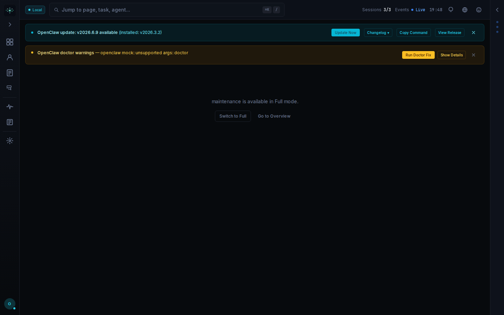

**What's rendered:** Identical layout — "maintenance is available in Full mode." gate.

| Severity | Problem | Law | Visible evidence | Fix |
|----------|---------|-----|-----------------|-----|
| P1 | Persistent dual-banner pattern is most harmful on Maintenance — a high-stakes operational page where clarity is critical | Hick's Law / Aesthetic-Usability | OpenClaw update banner (4 buttons) + doctor warnings banner (2 buttons) occupy the entire top of the screen before any maintenance content is reachable | System-level alerts must never block page-level operational content; move them to a persistent but collapsible global notification bar at the bottom or behind a bell icon |
| P2 | Empty state on a potentially destructive-action page provides no confirmation that the user reached the right place or understands risk | Gestalt Proximity / Doherty Threshold | Below the two banners, the entire visible area is black except for the dim centered text and two small buttons; no maintenance-specific iconography, warning cues, or state description | Show a locked feature card that names available maintenance actions with lock icons, communicates risk level, and explains what Full mode unlocks — priming the user for the destructive-action context before they switch modes |

---

## Highest-impact visual fixes

Ranked by the number of screens affected and the severity of the violation:

1. **Collapse both persistent alert banners into a single notification icon badge** (affects all 41 screens). Move all system notifications to a collapsible notification tray in the header. Show inline banners only on click or for the single highest-priority alert. This eliminates the dominant visual blocker on every route and recovers 130–170 px of content real estate globally.

2. **Implement a single, content-rich `<ModeGate>` component** (affects ~28 screens). Each gated page must render a unique h1 (≥24 px, high contrast), a one-sentence feature description, a filled teal "Switch to Full Mode" CTA (≥44 px), and "Go to Overview" as a plain text link. Remove all 28 ad-hoc bare-sentence copies immediately.

3. **Add lock badges and 40% opacity treatment to all gated sidebar nav items** (affects all gated screens). Users must never have to click a nav item to discover it is inaccessible. Apply a lock-badge overlay and "Requires Full mode" tooltip to team, standup, office, skills, monitor, nodes, debug, failures, artifacts, approval-queue, exec-approvals, campaigns, cron, content-runs, cost-tracker, tokens, costs, memory, github, channels, security, audit, alerts, webhooks, maintenance, super-admin, gateways, gateway-config, integrations, and users.

4. **Enforce the single-accent-color rule across the entire application** (affects all screens with banners or CTAs). Reserve teal exclusively for primary interactive CTAs. Use neutral dark backgrounds with a single amber border-left stripe for warnings; remove all amber-filled buttons. Eliminate blue info boxes, orange step badges used as a distinct accent, and purple avatar badges not documented in the design system.

5. **Raise all body/description text to ≥15 px at ≥4.5:1 contrast** (affects login, all gate messages, Settings section descriptions, and Log Viewer empty state). Audit every text instance below #bbb on #111 and every instance below 15 px that is not explicitly decorative.

6. **Fix the Activity empty-state copy** (affects activity screen). Show "No activity yet — sessions will appear here once agents start running" when all filters are at defaults. Reserve "Try adjusting your filters" for non-default filter states only.

7. **Replace the four-button Kanban empty state with a consolidated single CTA** (affects tasks screen). Remove four identical "Drop tasks here" placeholders; show one centered "Create your first task" button with a brief explanation.

8. **Widen the Chat session sidebar and fix session label truncation** (affects chat screen). Increase sidebar to 260–280 px minimum or adopt a two-line row layout so session names are never clipped.

9. **Persist banner dismiss state in session storage** (affects nodes, monitor, failures, artifacts, debug, and all other gated screens). Once dismissed, banners must not reappear on page navigation within the same session.

10. **Remove raw file paths and CLI error strings from end-user-facing UI** (affects agents and the amber banner on all screens). Wrap internal paths in a collapsed "Checked paths ▸" disclosure; replace "openclaw mock: unsupported args: doctor" with a plain-language equivalent.
